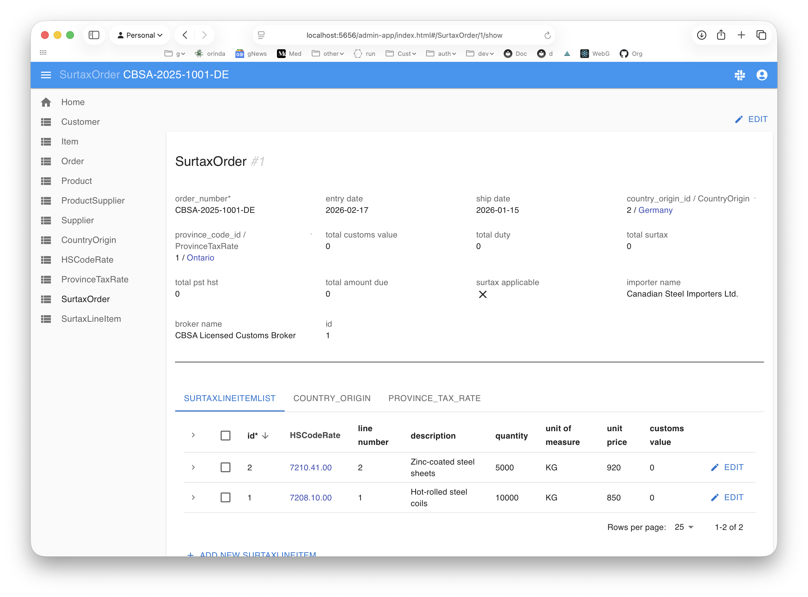
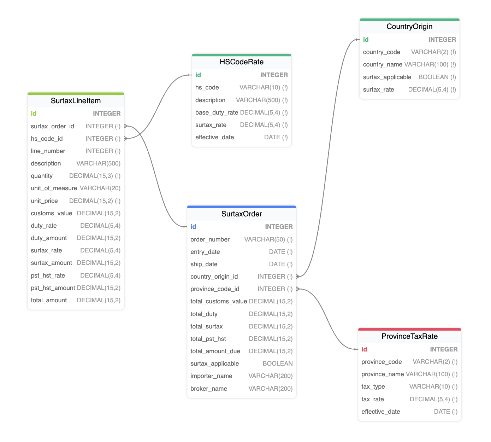

This report shows test results with embedded logic execution traces.

**For complete documentation on using Behave:** See [Behave.md](https://apilogicserver.github.io/Docs/Behave/)

**About This Project:**





_**TODO:** [Describe your project here - what it does, key features tested, etc.]_

&nbsp;

This report combines:

* Behave log (lists Features, test Scenarios, results), with embedded
* Logic showing rules executed, and how they operated

---

# Behave Logic Report
&nbsp;
&nbsp;
## Feature: About Sample  
  
&nbsp;
&nbsp;
### Scenario: Transaction Processing
&emsp;  Scenario: Transaction Processing  
&emsp;&emsp;    Given Sample Database  
&emsp;&emsp;    When Transactions are submitted  
&emsp;&emsp;    Then Enforce business policies with Logic (rules + code)  
<details markdown>
<summary>Tests - and their logic - are transparent.. click to see Logic</summary>


&nbsp;
&nbsp;


**Rules Used** in Scenario: Transaction Processing
```
```
**Logic Log** in Scenario: Transaction Processing
```
```
</details>
  
&nbsp;
&nbsp;
## Feature: CBSA Steel Derivative Goods Surtax  
  
  Background: Load Sample Database  
  
&nbsp;
&nbsp;
### Scenario: Surtax applies for post-cutoff ship date with surtax country
&emsp;  Scenario: Surtax applies for post-cutoff ship date with surtax country  
&emsp;&emsp;    Given the CBSA surtax database is loaded  
&emsp;&emsp;    Given a SurtaxOrder for Germany to Ontario with ship_date 2026-01-15 and entry_date 2026-01-10  
      Assertion Failed: Country not found: Germany (DE)  
  
&emsp;&emsp;    When a line item is added with hs_code 7208.10.00 quantity 1000 and unit_price 500.00  
&emsp;&emsp;    Then the line item customs_value is 500000.00  
    And the line item surtax_amount is 125000.00  
    And the line item duty_amount is 0.00  
    And the line item pst_hst_amount is 81250.00  
    And the line item total_amount is 706250.00  
    And the order surtax_applicable is True  
    And the order total_customs_value is 500000.00  
    And the order total_surtax is 125000.00  
    And the order total_amount_due is 706250.00  
<details markdown>
<summary>Tests - and their logic - are transparent.. click to see Logic</summary>


&nbsp;
&nbsp;


**Rules Used** in Scenario: Surtax applies for post-cutoff ship date with surtax country
```
  SurtaxLineItem  
    1. Derive <class 'database.models.SurtaxLineItem'>.duty_amount as Formula (2): as_expression=lambda row: row.customs_value * (ro [...]  
    2. Derive <class 'database.models.SurtaxLineItem'>.pst_hst_rate as Formula (4): <function>  
    3. Derive <class 'database.models.SurtaxLineItem'>.duty_rate as Copy(hs_code_rate.base_duty_rate)  
    4. Derive <class 'database.models.SurtaxLineItem'>.surtax_rate as Copy(hs_code_rate.surtax_rate)  
    5. Derive <class 'database.models.SurtaxLineItem'>.pst_hst_amount as Formula (5): as_expression=lambda row: (row.customs_value + (r [...]  
    6. Derive <class 'database.models.SurtaxLineItem'>.total_amount as Formula (6): as_expression=lambda row: (row.customs_value +   
  [...]  
    7. Derive <class 'database.models.SurtaxLineItem'>.surtax_amount as Formula (3): <function>  
    8. Derive <class 'database.models.SurtaxLineItem'>.customs_value as Formula (1): as_expression=lambda row: row.quantity * row.unit [...]  
  SurtaxOrder  
    9. Derive <class 'database.models.SurtaxOrder'>.total_amount_due as Sum(SurtaxLineItem.total_amount Where  - None)  
    10. Derive <class 'database.models.SurtaxOrder'>.total_customs_value as Sum(SurtaxLineItem.customs_value Where  - None)  
    11. Derive <class 'database.models.SurtaxOrder'>.total_surtax as Sum(SurtaxLineItem.surtax_amount Where  - None)  
    12. Derive <class 'database.models.SurtaxOrder'>.surtax_applicable as Formula (1): <function>  
    13. Derive <class 'database.models.SurtaxOrder'>.total_pst_hst as Sum(SurtaxLineItem.pst_hst_amount Where  - None)  
    14. Derive <class 'database.models.SurtaxOrder'>.total_duty as Sum(SurtaxLineItem.duty_amount Where  - None)  
```
**Logic Log** in Scenario: Surtax applies for post-cutoff ship date with surtax country
```
Logic Phase:		ROW LOGIC		(session=0x10cb2a360) (sqlalchemy before_flush)			 - 2026-02-18 09:16:38,569 - logic_logger - INF
..SurtaxLineItem[None] {Insert - client} id: None, surtax_order_id: 34, hs_code_id: 1, line_number: 1, description: Behave test item - 7208.10.00, quantity: 1000, unit_of_measure: None, unit_price: 500, customs_value: None, duty_rate: None, duty_amount: None, surtax_rate: None, surtax_amount: None, pst_hst_rate: None, pst_hst_amount: None, total_amount: None  row: 0x10cbaa5f0  session: 0x10cb2a360  ins_upd_dlt: ins, initial: ins - 2026-02-18 09:16:38,570 - logic_logger - INF
..SurtaxLineItem[None] {copy_rules for role: hs_code_rate - duty_rate, surtax_rate} id: None, surtax_order_id: 34, hs_code_id: 1, line_number: 1, description: Behave test item - 7208.10.00, quantity: 1000, unit_of_measure: None, unit_price: 500, customs_value: None, duty_rate: 0.0000, duty_amount: None, surtax_rate: 0.2500, surtax_amount: None, pst_hst_rate: None, pst_hst_amount: None, total_amount: None  row: 0x10cbaa5f0  session: 0x10cb2a360  ins_upd_dlt: ins, initial: ins - 2026-02-18 09:16:38,573 - logic_logger - INF
..SurtaxLineItem[None] {Formula customs_value} id: None, surtax_order_id: 34, hs_code_id: 1, line_number: 1, description: Behave test item - 7208.10.00, quantity: 1000, unit_of_measure: None, unit_price: 500, customs_value: 500000, duty_rate: 0.0000, duty_amount: None, surtax_rate: 0.2500, surtax_amount: None, pst_hst_rate: None, pst_hst_amount: None, total_amount: None  row: 0x10cbaa5f0  session: 0x10cb2a360  ins_upd_dlt: ins, initial: ins - 2026-02-18 09:16:38,574 - logic_logger - INF
..SurtaxLineItem[None] {Formula duty_amount} id: None, surtax_order_id: 34, hs_code_id: 1, line_number: 1, description: Behave test item - 7208.10.00, quantity: 1000, unit_of_measure: None, unit_price: 500, customs_value: 500000, duty_rate: 0.0000, duty_amount: 0, surtax_rate: 0.2500, surtax_amount: None, pst_hst_rate: None, pst_hst_amount: None, total_amount: None  row: 0x10cbaa5f0  session: 0x10cb2a360  ins_upd_dlt: ins, initial: ins - 2026-02-18 09:16:38,575 - logic_logger - INF
..SurtaxLineItem[None] {Surtax Amount: 125000.0000 (Applicable: True)} id: None, surtax_order_id: 34, hs_code_id: 1, line_number: 1, description: Behave test item - 7208.10.00, quantity: 1000, unit_of_measure: None, unit_price: 500, customs_value: 500000, duty_rate: 0.0000, duty_amount: 0, surtax_rate: 0.2500, surtax_amount: None, pst_hst_rate: None, pst_hst_amount: None, total_amount: None  row: 0x10cbaa5f0  session: 0x10cb2a360  ins_upd_dlt: ins, initial: ins - 2026-02-18 09:16:38,575 - logic_logger - INF
..SurtaxLineItem[None] {Formula surtax_amount} id: None, surtax_order_id: 34, hs_code_id: 1, line_number: 1, description: Behave test item - 7208.10.00, quantity: 1000, unit_of_measure: None, unit_price: 500, customs_value: 500000, duty_rate: 0.0000, duty_amount: 0, surtax_rate: 0.2500, surtax_amount: 125000.0000, pst_hst_rate: None, pst_hst_amount: None, total_amount: None  row: 0x10cbaa5f0  session: 0x10cb2a360  ins_upd_dlt: ins, initial: ins - 2026-02-18 09:16:38,576 - logic_logger - INF
..SurtaxLineItem[None] {PST/HST Rate: 0.1300} id: None, surtax_order_id: 34, hs_code_id: 1, line_number: 1, description: Behave test item - 7208.10.00, quantity: 1000, unit_of_measure: None, unit_price: 500, customs_value: 500000, duty_rate: 0.0000, duty_amount: 0, surtax_rate: 0.2500, surtax_amount: 125000.0000, pst_hst_rate: None, pst_hst_amount: None, total_amount: None  row: 0x10cbaa5f0  session: 0x10cb2a360  ins_upd_dlt: ins, initial: ins - 2026-02-18 09:16:38,577 - logic_logger - INF
..SurtaxLineItem[None] {Formula pst_hst_rate} id: None, surtax_order_id: 34, hs_code_id: 1, line_number: 1, description: Behave test item - 7208.10.00, quantity: 1000, unit_of_measure: None, unit_price: 500, customs_value: 500000, duty_rate: 0.0000, duty_amount: 0, surtax_rate: 0.2500, surtax_amount: 125000.0000, pst_hst_rate: 0.1300, pst_hst_amount: None, total_amount: None  row: 0x10cbaa5f0  session: 0x10cb2a360  ins_upd_dlt: ins, initial: ins - 2026-02-18 09:16:38,577 - logic_logger - INF
..SurtaxLineItem[None] {Formula pst_hst_amount} id: None, surtax_order_id: 34, hs_code_id: 1, line_number: 1, description: Behave test item - 7208.10.00, quantity: 1000, unit_of_measure: None, unit_price: 500, customs_value: 500000, duty_rate: 0.0000, duty_amount: 0, surtax_rate: 0.2500, surtax_amount: 125000.0000, pst_hst_rate: 0.1300, pst_hst_amount: 81250.00000000, total_amount: None  row: 0x10cbaa5f0  session: 0x10cb2a360  ins_upd_dlt: ins, initial: ins - 2026-02-18 09:16:38,578 - logic_logger - INF
..SurtaxLineItem[None] {Formula total_amount} id: None, surtax_order_id: 34, hs_code_id: 1, line_number: 1, description: Behave test item - 7208.10.00, quantity: 1000, unit_of_measure: None, unit_price: 500, customs_value: 500000, duty_rate: 0.0000, duty_amount: 0, surtax_rate: 0.2500, surtax_amount: 125000.0000, pst_hst_rate: 0.1300, pst_hst_amount: 81250.00000000, total_amount: 706250.00000000  row: 0x10cbaa5f0  session: 0x10cb2a360  ins_upd_dlt: ins, initial: ins - 2026-02-18 09:16:38,578 - logic_logger - INF
..SurtaxLineItem[None] {TODO DB adjust_from_inserted/adopted_child adjusts Derive <class 'database.models.SurtaxOrder'>.total_customs_value as Sum(SurtaxLineItem.customs_value Where  - None)} id: None, surtax_order_id: 34, hs_code_id: 1, line_number: 1, description: Behave test item - 7208.10.00, quantity: 1000, unit_of_measure: None, unit_price: 500, customs_value: 500000, duty_rate: 0.0000, duty_amount: 0, surtax_rate: 0.2500, surtax_amount: 125000.0000, pst_hst_rate: 0.1300, pst_hst_amount: 81250.00000000, total_amount: 706250.00000000  row: 0x10cbaa5f0  session: 0x10cb2a360  ins_upd_dlt: ins, initial: ins - 2026-02-18 09:16:38,579 - logic_logger - INF
..SurtaxLineItem[None] {TODO DB adjust_from_inserted/adopted_child adjusts Derive <class 'database.models.SurtaxOrder'>.total_surtax as Sum(SurtaxLineItem.surtax_amount Where  - None)} id: None, surtax_order_id: 34, hs_code_id: 1, line_number: 1, description: Behave test item - 7208.10.00, quantity: 1000, unit_of_measure: None, unit_price: 500, customs_value: 500000, duty_rate: 0.0000, duty_amount: 0, surtax_rate: 0.2500, surtax_amount: 125000.0000, pst_hst_rate: 0.1300, pst_hst_amount: 81250.00000000, total_amount: 706250.00000000  row: 0x10cbaa5f0  session: 0x10cb2a360  ins_upd_dlt: ins, initial: ins - 2026-02-18 09:16:38,580 - logic_logger - INF
..SurtaxLineItem[None] {TODO DB adjust_from_inserted/adopted_child adjusts Derive <class 'database.models.SurtaxOrder'>.total_pst_hst as Sum(SurtaxLineItem.pst_hst_amount Where  - None)} id: None, surtax_order_id: 34, hs_code_id: 1, line_number: 1, description: Behave test item - 7208.10.00, quantity: 1000, unit_of_measure: None, unit_price: 500, customs_value: 500000, duty_rate: 0.0000, duty_amount: 0, surtax_rate: 0.2500, surtax_amount: 125000.0000, pst_hst_rate: 0.1300, pst_hst_amount: 81250.00000000, total_amount: 706250.00000000  row: 0x10cbaa5f0  session: 0x10cb2a360  ins_upd_dlt: ins, initial: ins - 2026-02-18 09:16:38,581 - logic_logger - INF
..SurtaxLineItem[None] {TODO DB adjust_from_inserted/adopted_child adjusts Derive <class 'database.models.SurtaxOrder'>.total_amount_due as Sum(SurtaxLineItem.total_amount Where  - None)} id: None, surtax_order_id: 34, hs_code_id: 1, line_number: 1, description: Behave test item - 7208.10.00, quantity: 1000, unit_of_measure: None, unit_price: 500, customs_value: 500000, duty_rate: 0.0000, duty_amount: 0, surtax_rate: 0.2500, surtax_amount: 125000.0000, pst_hst_rate: 0.1300, pst_hst_amount: 81250.00000000, total_amount: 706250.00000000  row: 0x10cbaa5f0  session: 0x10cb2a360  ins_upd_dlt: ins, initial: ins - 2026-02-18 09:16:38,581 - logic_logger - INF
....SurtaxOrder[34] {Update - Adjusting surtax_order: total_customs_value, total_surtax, total_pst_hst, total_amount_due} id: 34, order_number: TEST-GE-175180ef, entry_date: 2026-01-10, ship_date: 2026-01-15, country_origin_id: 2, province_code_id: 1, total_customs_value:  [0.00-->] 500000.00, total_duty: 0.00, total_surtax:  [0.00-->] 125000.0000, total_pst_hst:  [0.00-->] 81250.00000000, total_amount_due:  [0.00-->] 706250.00000000, surtax_applicable: True, importer_name: Behave Test - Germany, broker_name: None  row: 0x10cb6e1a0  session: 0x10cb2a360  ins_upd_dlt: upd, initial: upd - 2026-02-18 09:16:38,581 - logic_logger - INF
....SurtaxOrder[34] {Surtax Applicable: True (Ship Date: 2026-01-15, Date Check: True, Country Check: True, Cutoff: 2025-12-26)} id: 34, order_number: TEST-GE-175180ef, entry_date: 2026-01-10, ship_date: 2026-01-15, country_origin_id: 2, province_code_id: 1, total_customs_value:  [0.00-->] 500000.00, total_duty: 0.00, total_surtax:  [0.00-->] 125000.0000, total_pst_hst:  [0.00-->] 81250.00000000, total_amount_due:  [0.00-->] 706250.00000000, surtax_applicable: True, importer_name: Behave Test - Germany, broker_name: None  row: 0x10cb6e1a0  session: 0x10cb2a360  ins_upd_dlt: upd, initial: upd - 2026-02-18 09:16:38,583 - logic_logger - INF
......SurtaxLineItem[None] {Update - Cascading surtax_order.province_tax_rate (,...)} id: None, surtax_order_id: 34, hs_code_id: 1, line_number: 1, description: Behave test item - 7208.10.00, quantity: 1000, unit_of_measure: None, unit_price: 500, customs_value: 500000, duty_rate: 0.0000, duty_amount: 0, surtax_rate: 0.2500, surtax_amount: 125000.0000, pst_hst_rate: 0.1300, pst_hst_amount: 81250.00000000, total_amount: 706250.00000000  row: 0x10cbaa5f0  session: 0x10cb2a360  ins_upd_dlt: upd, initial: upd - 2026-02-18 09:16:38,586 - logic_logger - INF
......SurtaxLineItem[None] {Prune Formula: customs_value [['quantity', 'unit_price']]} id: None, surtax_order_id: 34, hs_code_id: 1, line_number: 1, description: Behave test item - 7208.10.00, quantity: 1000, unit_of_measure: None, unit_price: 500, customs_value: 500000, duty_rate: 0.0000, duty_amount: 0, surtax_rate: 0.2500, surtax_amount: 125000.0000, pst_hst_rate: 0.1300, pst_hst_amount: 81250.00000000, total_amount: 706250.00000000  row: 0x10cbaa5f0  session: 0x10cb2a360  ins_upd_dlt: upd, initial: upd - 2026-02-18 09:16:38,587 - logic_logger - INF
......SurtaxLineItem[None] {Prune Formula: duty_amount [['customs_value', 'duty_rate']]} id: None, surtax_order_id: 34, hs_code_id: 1, line_number: 1, description: Behave test item - 7208.10.00, quantity: 1000, unit_of_measure: None, unit_price: 500, customs_value: 500000, duty_rate: 0.0000, duty_amount: 0, surtax_rate: 0.2500, surtax_amount: 125000.0000, pst_hst_rate: 0.1300, pst_hst_amount: 81250.00000000, total_amount: 706250.00000000  row: 0x10cbaa5f0  session: 0x10cb2a360  ins_upd_dlt: upd, initial: upd - 2026-02-18 09:16:38,588 - logic_logger - INF
......SurtaxLineItem[None] {Surtax Amount: 125000.0000 (Applicable: True)} id: None, surtax_order_id: 34, hs_code_id: 1, line_number: 1, description: Behave test item - 7208.10.00, quantity: 1000, unit_of_measure: None, unit_price: 500, customs_value: 500000, duty_rate: 0.0000, duty_amount: 0, surtax_rate: 0.2500, surtax_amount: 125000.0000, pst_hst_rate: 0.1300, pst_hst_amount: 81250.00000000, total_amount: 706250.00000000  row: 0x10cbaa5f0  session: 0x10cb2a360  ins_upd_dlt: upd, initial: upd - 2026-02-18 09:16:38,588 - logic_logger - INF
......SurtaxLineItem[None] {PST/HST Rate: 0.1300} id: None, surtax_order_id: 34, hs_code_id: 1, line_number: 1, description: Behave test item - 7208.10.00, quantity: 1000, unit_of_measure: None, unit_price: 500, customs_value: 500000, duty_rate: 0.0000, duty_amount: 0, surtax_rate: 0.2500, surtax_amount: 125000.0000, pst_hst_rate: 0.1300, pst_hst_amount: 81250.00000000, total_amount: 706250.00000000  row: 0x10cbaa5f0  session: 0x10cb2a360  ins_upd_dlt: upd, initial: upd - 2026-02-18 09:16:38,589 - logic_logger - INF
......SurtaxLineItem[None] {Prune Formula: pst_hst_amount [['customs_value', 'duty_amount', 'surtax_amount', 'pst_hst_rate']]} id: None, surtax_order_id: 34, hs_code_id: 1, line_number: 1, description: Behave test item - 7208.10.00, quantity: 1000, unit_of_measure: None, unit_price: 500, customs_value: 500000, duty_rate: 0.0000, duty_amount: 0, surtax_rate: 0.2500, surtax_amount: 125000.0000, pst_hst_rate: 0.1300, pst_hst_amount: 81250.00000000, total_amount: 706250.00000000  row: 0x10cbaa5f0  session: 0x10cb2a360  ins_upd_dlt: upd, initial: upd - 2026-02-18 09:16:38,589 - logic_logger - INF
......SurtaxLineItem[None] {Prune Formula: total_amount [['customs_value', 'duty_amount', 'surtax_amount', 'pst_hst_amount']]} id: None, surtax_order_id: 34, hs_code_id: 1, line_number: 1, description: Behave test item - 7208.10.00, quantity: 1000, unit_of_measure: None, unit_price: 500, customs_value: 500000, duty_rate: 0.0000, duty_amount: 0, surtax_rate: 0.2500, surtax_amount: 125000.0000, pst_hst_rate: 0.1300, pst_hst_amount: 81250.00000000, total_amount: 706250.00000000  row: 0x10cbaa5f0  session: 0x10cb2a360  ins_upd_dlt: upd, initial: upd - 2026-02-18 09:16:38,590 - logic_logger - INF
Logic Phase:		COMMIT LOGIC		(session=0x10cb2a360)   										 - 2026-02-18 09:16:38,593 - logic_logger - INF
Logic Phase:		AFTER_FLUSH LOGIC	(session=0x10cb2a360)   										 - 2026-02-18 09:16:38,596 - logic_logger - INF

```
</details>
  
&nbsp;
&nbsp;
### Scenario: No surtax for pre-cutoff ship date
&emsp;  Scenario: No surtax for pre-cutoff ship date  
&emsp;&emsp;    Given the CBSA surtax database is loaded  
&emsp;&emsp;    Given a SurtaxOrder for Japan to Quebec with ship_date 2025-12-20 and entry_date 2025-12-15  
      Assertion Failed: Country not found: Japan (JP)  
  
&emsp;&emsp;    When a line item is added with hs_code 7213.91.00 quantity 500 and unit_price 200.00  
&emsp;&emsp;    Then the line item customs_value is 100000.00  
    And the line item surtax_amount is 0.00  
    And the order surtax_applicable is False  
    And the order total_surtax is 0.00  
<details markdown>
<summary>Tests - and their logic - are transparent.. click to see Logic</summary>


&nbsp;
&nbsp;


**Rules Used** in Scenario: No surtax for pre-cutoff ship date
```
  SurtaxLineItem  
    1. Derive <class 'database.models.SurtaxLineItem'>.duty_amount as Formula (2): as_expression=lambda row: row.customs_value * (ro [...]  
    2. Derive <class 'database.models.SurtaxLineItem'>.pst_hst_rate as Formula (4): <function>  
    3. Derive <class 'database.models.SurtaxLineItem'>.duty_rate as Copy(hs_code_rate.base_duty_rate)  
    4. Derive <class 'database.models.SurtaxLineItem'>.surtax_rate as Copy(hs_code_rate.surtax_rate)  
    5. Derive <class 'database.models.SurtaxLineItem'>.pst_hst_amount as Formula (5): as_expression=lambda row: (row.customs_value + (r [...]  
    6. Derive <class 'database.models.SurtaxLineItem'>.total_amount as Formula (6): as_expression=lambda row: (row.customs_value +   
  [...]  
    7. Derive <class 'database.models.SurtaxLineItem'>.surtax_amount as Formula (3): <function>  
    8. Derive <class 'database.models.SurtaxLineItem'>.customs_value as Formula (1): as_expression=lambda row: row.quantity * row.unit [...]  
  SurtaxOrder  
    9. Derive <class 'database.models.SurtaxOrder'>.total_amount_due as Sum(SurtaxLineItem.total_amount Where  - None)  
    10. Derive <class 'database.models.SurtaxOrder'>.total_customs_value as Sum(SurtaxLineItem.customs_value Where  - None)  
    11. Derive <class 'database.models.SurtaxOrder'>.total_surtax as Sum(SurtaxLineItem.surtax_amount Where  - None)  
    12. Derive <class 'database.models.SurtaxOrder'>.surtax_applicable as Formula (1): <function>  
    13. Derive <class 'database.models.SurtaxOrder'>.total_pst_hst as Sum(SurtaxLineItem.pst_hst_amount Where  - None)  
    14. Derive <class 'database.models.SurtaxOrder'>.total_duty as Sum(SurtaxLineItem.duty_amount Where  - None)  
```
**Logic Log** in Scenario: No surtax for pre-cutoff ship date
```
Logic Phase:		ROW LOGIC		(session=0x10cb285a0) (sqlalchemy before_flush)			 - 2026-02-18 09:16:38,678 - logic_logger - INF
..SurtaxLineItem[None] {Insert - client} id: None, surtax_order_id: 35, hs_code_id: 3, line_number: 1, description: Behave test item - 7213.91.00, quantity: 500, unit_of_measure: None, unit_price: 200, customs_value: None, duty_rate: None, duty_amount: None, surtax_rate: None, surtax_amount: None, pst_hst_rate: None, pst_hst_amount: None, total_amount: None  row: 0x10cb082f0  session: 0x10cb285a0  ins_upd_dlt: ins, initial: ins - 2026-02-18 09:16:38,679 - logic_logger - INF
..SurtaxLineItem[None] {copy_rules for role: hs_code_rate - duty_rate, surtax_rate} id: None, surtax_order_id: 35, hs_code_id: 3, line_number: 1, description: Behave test item - 7213.91.00, quantity: 500, unit_of_measure: None, unit_price: 200, customs_value: None, duty_rate: 0.0000, duty_amount: None, surtax_rate: 0.2500, surtax_amount: None, pst_hst_rate: None, pst_hst_amount: None, total_amount: None  row: 0x10cb082f0  session: 0x10cb285a0  ins_upd_dlt: ins, initial: ins - 2026-02-18 09:16:38,682 - logic_logger - INF
..SurtaxLineItem[None] {Formula customs_value} id: None, surtax_order_id: 35, hs_code_id: 3, line_number: 1, description: Behave test item - 7213.91.00, quantity: 500, unit_of_measure: None, unit_price: 200, customs_value: 100000, duty_rate: 0.0000, duty_amount: None, surtax_rate: 0.2500, surtax_amount: None, pst_hst_rate: None, pst_hst_amount: None, total_amount: None  row: 0x10cb082f0  session: 0x10cb285a0  ins_upd_dlt: ins, initial: ins - 2026-02-18 09:16:38,683 - logic_logger - INF
..SurtaxLineItem[None] {Formula duty_amount} id: None, surtax_order_id: 35, hs_code_id: 3, line_number: 1, description: Behave test item - 7213.91.00, quantity: 500, unit_of_measure: None, unit_price: 200, customs_value: 100000, duty_rate: 0.0000, duty_amount: 0, surtax_rate: 0.2500, surtax_amount: None, pst_hst_rate: None, pst_hst_amount: None, total_amount: None  row: 0x10cb082f0  session: 0x10cb285a0  ins_upd_dlt: ins, initial: ins - 2026-02-18 09:16:38,683 - logic_logger - INF
..SurtaxLineItem[None] {Surtax Amount: 0 (Applicable: False)} id: None, surtax_order_id: 35, hs_code_id: 3, line_number: 1, description: Behave test item - 7213.91.00, quantity: 500, unit_of_measure: None, unit_price: 200, customs_value: 100000, duty_rate: 0.0000, duty_amount: 0, surtax_rate: 0.2500, surtax_amount: None, pst_hst_rate: None, pst_hst_amount: None, total_amount: None  row: 0x10cb082f0  session: 0x10cb285a0  ins_upd_dlt: ins, initial: ins - 2026-02-18 09:16:38,684 - logic_logger - INF
..SurtaxLineItem[None] {Formula surtax_amount} id: None, surtax_order_id: 35, hs_code_id: 3, line_number: 1, description: Behave test item - 7213.91.00, quantity: 500, unit_of_measure: None, unit_price: 200, customs_value: 100000, duty_rate: 0.0000, duty_amount: 0, surtax_rate: 0.2500, surtax_amount: 0, pst_hst_rate: None, pst_hst_amount: None, total_amount: None  row: 0x10cb082f0  session: 0x10cb285a0  ins_upd_dlt: ins, initial: ins - 2026-02-18 09:16:38,684 - logic_logger - INF
..SurtaxLineItem[None] {PST/HST Rate: 0.1497} id: None, surtax_order_id: 35, hs_code_id: 3, line_number: 1, description: Behave test item - 7213.91.00, quantity: 500, unit_of_measure: None, unit_price: 200, customs_value: 100000, duty_rate: 0.0000, duty_amount: 0, surtax_rate: 0.2500, surtax_amount: 0, pst_hst_rate: None, pst_hst_amount: None, total_amount: None  row: 0x10cb082f0  session: 0x10cb285a0  ins_upd_dlt: ins, initial: ins - 2026-02-18 09:16:38,685 - logic_logger - INF
..SurtaxLineItem[None] {Formula pst_hst_rate} id: None, surtax_order_id: 35, hs_code_id: 3, line_number: 1, description: Behave test item - 7213.91.00, quantity: 500, unit_of_measure: None, unit_price: 200, customs_value: 100000, duty_rate: 0.0000, duty_amount: 0, surtax_rate: 0.2500, surtax_amount: 0, pst_hst_rate: 0.1497, pst_hst_amount: None, total_amount: None  row: 0x10cb082f0  session: 0x10cb285a0  ins_upd_dlt: ins, initial: ins - 2026-02-18 09:16:38,685 - logic_logger - INF
..SurtaxLineItem[None] {Formula pst_hst_amount} id: None, surtax_order_id: 35, hs_code_id: 3, line_number: 1, description: Behave test item - 7213.91.00, quantity: 500, unit_of_measure: None, unit_price: 200, customs_value: 100000, duty_rate: 0.0000, duty_amount: 0, surtax_rate: 0.2500, surtax_amount: 0, pst_hst_rate: 0.1497, pst_hst_amount: 14970.0000, total_amount: None  row: 0x10cb082f0  session: 0x10cb285a0  ins_upd_dlt: ins, initial: ins - 2026-02-18 09:16:38,686 - logic_logger - INF
..SurtaxLineItem[None] {Formula total_amount} id: None, surtax_order_id: 35, hs_code_id: 3, line_number: 1, description: Behave test item - 7213.91.00, quantity: 500, unit_of_measure: None, unit_price: 200, customs_value: 100000, duty_rate: 0.0000, duty_amount: 0, surtax_rate: 0.2500, surtax_amount: 0, pst_hst_rate: 0.1497, pst_hst_amount: 14970.0000, total_amount: 114970.0000  row: 0x10cb082f0  session: 0x10cb285a0  ins_upd_dlt: ins, initial: ins - 2026-02-18 09:16:38,686 - logic_logger - INF
..SurtaxLineItem[None] {TODO DB adjust_from_inserted/adopted_child adjusts Derive <class 'database.models.SurtaxOrder'>.total_customs_value as Sum(SurtaxLineItem.customs_value Where  - None)} id: None, surtax_order_id: 35, hs_code_id: 3, line_number: 1, description: Behave test item - 7213.91.00, quantity: 500, unit_of_measure: None, unit_price: 200, customs_value: 100000, duty_rate: 0.0000, duty_amount: 0, surtax_rate: 0.2500, surtax_amount: 0, pst_hst_rate: 0.1497, pst_hst_amount: 14970.0000, total_amount: 114970.0000  row: 0x10cb082f0  session: 0x10cb285a0  ins_upd_dlt: ins, initial: ins - 2026-02-18 09:16:38,688 - logic_logger - INF
..SurtaxLineItem[None] {TODO DB adjust_from_inserted/adopted_child adjusts Derive <class 'database.models.SurtaxOrder'>.total_pst_hst as Sum(SurtaxLineItem.pst_hst_amount Where  - None)} id: None, surtax_order_id: 35, hs_code_id: 3, line_number: 1, description: Behave test item - 7213.91.00, quantity: 500, unit_of_measure: None, unit_price: 200, customs_value: 100000, duty_rate: 0.0000, duty_amount: 0, surtax_rate: 0.2500, surtax_amount: 0, pst_hst_rate: 0.1497, pst_hst_amount: 14970.0000, total_amount: 114970.0000  row: 0x10cb082f0  session: 0x10cb285a0  ins_upd_dlt: ins, initial: ins - 2026-02-18 09:16:38,688 - logic_logger - INF
..SurtaxLineItem[None] {TODO DB adjust_from_inserted/adopted_child adjusts Derive <class 'database.models.SurtaxOrder'>.total_amount_due as Sum(SurtaxLineItem.total_amount Where  - None)} id: None, surtax_order_id: 35, hs_code_id: 3, line_number: 1, description: Behave test item - 7213.91.00, quantity: 500, unit_of_measure: None, unit_price: 200, customs_value: 100000, duty_rate: 0.0000, duty_amount: 0, surtax_rate: 0.2500, surtax_amount: 0, pst_hst_rate: 0.1497, pst_hst_amount: 14970.0000, total_amount: 114970.0000  row: 0x10cb082f0  session: 0x10cb285a0  ins_upd_dlt: ins, initial: ins - 2026-02-18 09:16:38,689 - logic_logger - INF
....SurtaxOrder[35] {Update - Adjusting surtax_order: total_customs_value, total_pst_hst, total_amount_due} id: 35, order_number: TEST-JA-b734c58b, entry_date: 2025-12-15, ship_date: 2025-12-20, country_origin_id: 4, province_code_id: 9, total_customs_value:  [0.00-->] 100000.00, total_duty: 0.00, total_surtax: 0.00, total_pst_hst:  [0.00-->] 14970.0000, total_amount_due:  [0.00-->] 114970.0000, surtax_applicable: False, importer_name: Behave Test - Japan, broker_name: None  row: 0x10caefba0  session: 0x10cb285a0  ins_upd_dlt: upd, initial: upd - 2026-02-18 09:16:38,689 - logic_logger - INF
....SurtaxOrder[35] {Surtax Applicable: False (Ship Date: 2025-12-20, Date Check: False, Country Check: True, Cutoff: 2025-12-26)} id: 35, order_number: TEST-JA-b734c58b, entry_date: 2025-12-15, ship_date: 2025-12-20, country_origin_id: 4, province_code_id: 9, total_customs_value:  [0.00-->] 100000.00, total_duty: 0.00, total_surtax: 0.00, total_pst_hst:  [0.00-->] 14970.0000, total_amount_due:  [0.00-->] 114970.0000, surtax_applicable: False, importer_name: Behave Test - Japan, broker_name: None  row: 0x10caefba0  session: 0x10cb285a0  ins_upd_dlt: upd, initial: upd - 2026-02-18 09:16:38,691 - logic_logger - INF
......SurtaxLineItem[None] {Update - Cascading surtax_order.province_tax_rate (,...)} id: None, surtax_order_id: 35, hs_code_id: 3, line_number: 1, description: Behave test item - 7213.91.00, quantity: 500, unit_of_measure: None, unit_price: 200, customs_value: 100000, duty_rate: 0.0000, duty_amount: 0, surtax_rate: 0.2500, surtax_amount: 0, pst_hst_rate: 0.1497, pst_hst_amount: 14970.0000, total_amount: 114970.0000  row: 0x10cb082f0  session: 0x10cb285a0  ins_upd_dlt: upd, initial: upd - 2026-02-18 09:16:38,693 - logic_logger - INF
......SurtaxLineItem[None] {Prune Formula: customs_value [['quantity', 'unit_price']]} id: None, surtax_order_id: 35, hs_code_id: 3, line_number: 1, description: Behave test item - 7213.91.00, quantity: 500, unit_of_measure: None, unit_price: 200, customs_value: 100000, duty_rate: 0.0000, duty_amount: 0, surtax_rate: 0.2500, surtax_amount: 0, pst_hst_rate: 0.1497, pst_hst_amount: 14970.0000, total_amount: 114970.0000  row: 0x10cb082f0  session: 0x10cb285a0  ins_upd_dlt: upd, initial: upd - 2026-02-18 09:16:38,694 - logic_logger - INF
......SurtaxLineItem[None] {Prune Formula: duty_amount [['customs_value', 'duty_rate']]} id: None, surtax_order_id: 35, hs_code_id: 3, line_number: 1, description: Behave test item - 7213.91.00, quantity: 500, unit_of_measure: None, unit_price: 200, customs_value: 100000, duty_rate: 0.0000, duty_amount: 0, surtax_rate: 0.2500, surtax_amount: 0, pst_hst_rate: 0.1497, pst_hst_amount: 14970.0000, total_amount: 114970.0000  row: 0x10cb082f0  session: 0x10cb285a0  ins_upd_dlt: upd, initial: upd - 2026-02-18 09:16:38,695 - logic_logger - INF
......SurtaxLineItem[None] {Surtax Amount: 0 (Applicable: False)} id: None, surtax_order_id: 35, hs_code_id: 3, line_number: 1, description: Behave test item - 7213.91.00, quantity: 500, unit_of_measure: None, unit_price: 200, customs_value: 100000, duty_rate: 0.0000, duty_amount: 0, surtax_rate: 0.2500, surtax_amount: 0, pst_hst_rate: 0.1497, pst_hst_amount: 14970.0000, total_amount: 114970.0000  row: 0x10cb082f0  session: 0x10cb285a0  ins_upd_dlt: upd, initial: upd - 2026-02-18 09:16:38,695 - logic_logger - INF
......SurtaxLineItem[None] {PST/HST Rate: 0.1497} id: None, surtax_order_id: 35, hs_code_id: 3, line_number: 1, description: Behave test item - 7213.91.00, quantity: 500, unit_of_measure: None, unit_price: 200, customs_value: 100000, duty_rate: 0.0000, duty_amount: 0, surtax_rate: 0.2500, surtax_amount: 0, pst_hst_rate: 0.1497, pst_hst_amount: 14970.0000, total_amount: 114970.0000  row: 0x10cb082f0  session: 0x10cb285a0  ins_upd_dlt: upd, initial: upd - 2026-02-18 09:16:38,696 - logic_logger - INF
......SurtaxLineItem[None] {Prune Formula: pst_hst_amount [['customs_value', 'duty_amount', 'surtax_amount', 'pst_hst_rate']]} id: None, surtax_order_id: 35, hs_code_id: 3, line_number: 1, description: Behave test item - 7213.91.00, quantity: 500, unit_of_measure: None, unit_price: 200, customs_value: 100000, duty_rate: 0.0000, duty_amount: 0, surtax_rate: 0.2500, surtax_amount: 0, pst_hst_rate: 0.1497, pst_hst_amount: 14970.0000, total_amount: 114970.0000  row: 0x10cb082f0  session: 0x10cb285a0  ins_upd_dlt: upd, initial: upd - 2026-02-18 09:16:38,696 - logic_logger - INF
......SurtaxLineItem[None] {Prune Formula: total_amount [['customs_value', 'duty_amount', 'surtax_amount', 'pst_hst_amount']]} id: None, surtax_order_id: 35, hs_code_id: 3, line_number: 1, description: Behave test item - 7213.91.00, quantity: 500, unit_of_measure: None, unit_price: 200, customs_value: 100000, duty_rate: 0.0000, duty_amount: 0, surtax_rate: 0.2500, surtax_amount: 0, pst_hst_rate: 0.1497, pst_hst_amount: 14970.0000, total_amount: 114970.0000  row: 0x10cb082f0  session: 0x10cb285a0  ins_upd_dlt: upd, initial: upd - 2026-02-18 09:16:38,697 - logic_logger - INF
Logic Phase:		COMMIT LOGIC		(session=0x10cb285a0)   										 - 2026-02-18 09:16:38,700 - logic_logger - INF
Logic Phase:		AFTER_FLUSH LOGIC	(session=0x10cb285a0)   										 - 2026-02-18 09:16:38,702 - logic_logger - INF

```
</details>
  
&nbsp;
&nbsp;
### Scenario: No surtax for non-surtax country (Mexico)
&emsp;  Scenario: No surtax for non-surtax country (Mexico)  
&emsp;&emsp;    Given the CBSA surtax database is loaded  
&emsp;&emsp;    Given a SurtaxOrder for Mexico to Alberta with ship_date 2026-02-01 and entry_date 2026-01-25  
      Assertion Failed: Country not found: Mexico (MX)  
  
&emsp;&emsp;    When a line item is added with hs_code 7308.90.00 quantity 200 and unit_price 150.00  
&emsp;&emsp;    Then the line item customs_value is 30000.00  
    And the line item surtax_amount is 0.00  
    And the order surtax_applicable is False  
<details markdown>
<summary>Tests - and their logic - are transparent.. click to see Logic</summary>


&nbsp;
&nbsp;


**Rules Used** in Scenario: No surtax for non-surtax country (Mexico)
```
  SurtaxLineItem  
    1. Derive <class 'database.models.SurtaxLineItem'>.duty_amount as Formula (2): as_expression=lambda row: row.customs_value * (ro [...]  
    2. Derive <class 'database.models.SurtaxLineItem'>.pst_hst_rate as Formula (4): <function>  
    3. Derive <class 'database.models.SurtaxLineItem'>.duty_rate as Copy(hs_code_rate.base_duty_rate)  
    4. Derive <class 'database.models.SurtaxLineItem'>.surtax_rate as Copy(hs_code_rate.surtax_rate)  
    5. Derive <class 'database.models.SurtaxLineItem'>.pst_hst_amount as Formula (5): as_expression=lambda row: (row.customs_value + (r [...]  
    6. Derive <class 'database.models.SurtaxLineItem'>.total_amount as Formula (6): as_expression=lambda row: (row.customs_value +   
  [...]  
    7. Derive <class 'database.models.SurtaxLineItem'>.surtax_amount as Formula (3): <function>  
    8. Derive <class 'database.models.SurtaxLineItem'>.customs_value as Formula (1): as_expression=lambda row: row.quantity * row.unit [...]  
  SurtaxOrder  
    9. Derive <class 'database.models.SurtaxOrder'>.total_amount_due as Sum(SurtaxLineItem.total_amount Where  - None)  
    10. Derive <class 'database.models.SurtaxOrder'>.total_customs_value as Sum(SurtaxLineItem.customs_value Where  - None)  
    11. Derive <class 'database.models.SurtaxOrder'>.total_surtax as Sum(SurtaxLineItem.surtax_amount Where  - None)  
    12. Derive <class 'database.models.SurtaxOrder'>.surtax_applicable as Formula (1): <function>  
    13. Derive <class 'database.models.SurtaxOrder'>.total_pst_hst as Sum(SurtaxLineItem.pst_hst_amount Where  - None)  
    14. Derive <class 'database.models.SurtaxOrder'>.total_duty as Sum(SurtaxLineItem.duty_amount Where  - None)  
```
**Logic Log** in Scenario: No surtax for non-surtax country (Mexico)
```
Logic Phase:		ROW LOGIC		(session=0x10cb29e10) (sqlalchemy before_flush)			 - 2026-02-18 09:16:38,751 - logic_logger - INF
..SurtaxLineItem[None] {Insert - client} id: None, surtax_order_id: 36, hs_code_id: 7, line_number: 1, description: Behave test item - 7308.90.00, quantity: 200, unit_of_measure: None, unit_price: 150, customs_value: None, duty_rate: None, duty_amount: None, surtax_rate: None, surtax_amount: None, pst_hst_rate: None, pst_hst_amount: None, total_amount: None  row: 0x10cc16b30  session: 0x10cb29e10  ins_upd_dlt: ins, initial: ins - 2026-02-18 09:16:38,752 - logic_logger - INF
..SurtaxLineItem[None] {copy_rules for role: hs_code_rate - duty_rate, surtax_rate} id: None, surtax_order_id: 36, hs_code_id: 7, line_number: 1, description: Behave test item - 7308.90.00, quantity: 200, unit_of_measure: None, unit_price: 150, customs_value: None, duty_rate: 0.0000, duty_amount: None, surtax_rate: 0.2500, surtax_amount: None, pst_hst_rate: None, pst_hst_amount: None, total_amount: None  row: 0x10cc16b30  session: 0x10cb29e10  ins_upd_dlt: ins, initial: ins - 2026-02-18 09:16:38,755 - logic_logger - INF
..SurtaxLineItem[None] {Formula customs_value} id: None, surtax_order_id: 36, hs_code_id: 7, line_number: 1, description: Behave test item - 7308.90.00, quantity: 200, unit_of_measure: None, unit_price: 150, customs_value: 30000, duty_rate: 0.0000, duty_amount: None, surtax_rate: 0.2500, surtax_amount: None, pst_hst_rate: None, pst_hst_amount: None, total_amount: None  row: 0x10cc16b30  session: 0x10cb29e10  ins_upd_dlt: ins, initial: ins - 2026-02-18 09:16:38,756 - logic_logger - INF
..SurtaxLineItem[None] {Formula duty_amount} id: None, surtax_order_id: 36, hs_code_id: 7, line_number: 1, description: Behave test item - 7308.90.00, quantity: 200, unit_of_measure: None, unit_price: 150, customs_value: 30000, duty_rate: 0.0000, duty_amount: 0, surtax_rate: 0.2500, surtax_amount: None, pst_hst_rate: None, pst_hst_amount: None, total_amount: None  row: 0x10cc16b30  session: 0x10cb29e10  ins_upd_dlt: ins, initial: ins - 2026-02-18 09:16:38,756 - logic_logger - INF
..SurtaxLineItem[None] {Surtax Amount: 0 (Applicable: False)} id: None, surtax_order_id: 36, hs_code_id: 7, line_number: 1, description: Behave test item - 7308.90.00, quantity: 200, unit_of_measure: None, unit_price: 150, customs_value: 30000, duty_rate: 0.0000, duty_amount: 0, surtax_rate: 0.2500, surtax_amount: None, pst_hst_rate: None, pst_hst_amount: None, total_amount: None  row: 0x10cc16b30  session: 0x10cb29e10  ins_upd_dlt: ins, initial: ins - 2026-02-18 09:16:38,756 - logic_logger - INF
..SurtaxLineItem[None] {Formula surtax_amount} id: None, surtax_order_id: 36, hs_code_id: 7, line_number: 1, description: Behave test item - 7308.90.00, quantity: 200, unit_of_measure: None, unit_price: 150, customs_value: 30000, duty_rate: 0.0000, duty_amount: 0, surtax_rate: 0.2500, surtax_amount: 0, pst_hst_rate: None, pst_hst_amount: None, total_amount: None  row: 0x10cc16b30  session: 0x10cb29e10  ins_upd_dlt: ins, initial: ins - 2026-02-18 09:16:38,757 - logic_logger - INF
..SurtaxLineItem[None] {PST/HST Rate: 0.0500} id: None, surtax_order_id: 36, hs_code_id: 7, line_number: 1, description: Behave test item - 7308.90.00, quantity: 200, unit_of_measure: None, unit_price: 150, customs_value: 30000, duty_rate: 0.0000, duty_amount: 0, surtax_rate: 0.2500, surtax_amount: 0, pst_hst_rate: None, pst_hst_amount: None, total_amount: None  row: 0x10cc16b30  session: 0x10cb29e10  ins_upd_dlt: ins, initial: ins - 2026-02-18 09:16:38,757 - logic_logger - INF
..SurtaxLineItem[None] {Formula pst_hst_rate} id: None, surtax_order_id: 36, hs_code_id: 7, line_number: 1, description: Behave test item - 7308.90.00, quantity: 200, unit_of_measure: None, unit_price: 150, customs_value: 30000, duty_rate: 0.0000, duty_amount: 0, surtax_rate: 0.2500, surtax_amount: 0, pst_hst_rate: 0.0500, pst_hst_amount: None, total_amount: None  row: 0x10cc16b30  session: 0x10cb29e10  ins_upd_dlt: ins, initial: ins - 2026-02-18 09:16:38,758 - logic_logger - INF
..SurtaxLineItem[None] {Formula pst_hst_amount} id: None, surtax_order_id: 36, hs_code_id: 7, line_number: 1, description: Behave test item - 7308.90.00, quantity: 200, unit_of_measure: None, unit_price: 150, customs_value: 30000, duty_rate: 0.0000, duty_amount: 0, surtax_rate: 0.2500, surtax_amount: 0, pst_hst_rate: 0.0500, pst_hst_amount: 1500.0000, total_amount: None  row: 0x10cc16b30  session: 0x10cb29e10  ins_upd_dlt: ins, initial: ins - 2026-02-18 09:16:38,758 - logic_logger - INF
..SurtaxLineItem[None] {Formula total_amount} id: None, surtax_order_id: 36, hs_code_id: 7, line_number: 1, description: Behave test item - 7308.90.00, quantity: 200, unit_of_measure: None, unit_price: 150, customs_value: 30000, duty_rate: 0.0000, duty_amount: 0, surtax_rate: 0.2500, surtax_amount: 0, pst_hst_rate: 0.0500, pst_hst_amount: 1500.0000, total_amount: 31500.0000  row: 0x10cc16b30  session: 0x10cb29e10  ins_upd_dlt: ins, initial: ins - 2026-02-18 09:16:38,759 - logic_logger - INF
..SurtaxLineItem[None] {TODO DB adjust_from_inserted/adopted_child adjusts Derive <class 'database.models.SurtaxOrder'>.total_customs_value as Sum(SurtaxLineItem.customs_value Where  - None)} id: None, surtax_order_id: 36, hs_code_id: 7, line_number: 1, description: Behave test item - 7308.90.00, quantity: 200, unit_of_measure: None, unit_price: 150, customs_value: 30000, duty_rate: 0.0000, duty_amount: 0, surtax_rate: 0.2500, surtax_amount: 0, pst_hst_rate: 0.0500, pst_hst_amount: 1500.0000, total_amount: 31500.0000  row: 0x10cc16b30  session: 0x10cb29e10  ins_upd_dlt: ins, initial: ins - 2026-02-18 09:16:38,760 - logic_logger - INF
..SurtaxLineItem[None] {TODO DB adjust_from_inserted/adopted_child adjusts Derive <class 'database.models.SurtaxOrder'>.total_pst_hst as Sum(SurtaxLineItem.pst_hst_amount Where  - None)} id: None, surtax_order_id: 36, hs_code_id: 7, line_number: 1, description: Behave test item - 7308.90.00, quantity: 200, unit_of_measure: None, unit_price: 150, customs_value: 30000, duty_rate: 0.0000, duty_amount: 0, surtax_rate: 0.2500, surtax_amount: 0, pst_hst_rate: 0.0500, pst_hst_amount: 1500.0000, total_amount: 31500.0000  row: 0x10cc16b30  session: 0x10cb29e10  ins_upd_dlt: ins, initial: ins - 2026-02-18 09:16:38,760 - logic_logger - INF
..SurtaxLineItem[None] {TODO DB adjust_from_inserted/adopted_child adjusts Derive <class 'database.models.SurtaxOrder'>.total_amount_due as Sum(SurtaxLineItem.total_amount Where  - None)} id: None, surtax_order_id: 36, hs_code_id: 7, line_number: 1, description: Behave test item - 7308.90.00, quantity: 200, unit_of_measure: None, unit_price: 150, customs_value: 30000, duty_rate: 0.0000, duty_amount: 0, surtax_rate: 0.2500, surtax_amount: 0, pst_hst_rate: 0.0500, pst_hst_amount: 1500.0000, total_amount: 31500.0000  row: 0x10cc16b30  session: 0x10cb29e10  ins_upd_dlt: ins, initial: ins - 2026-02-18 09:16:38,761 - logic_logger - INF
....SurtaxOrder[36] {Update - Adjusting surtax_order: total_customs_value, total_pst_hst, total_amount_due} id: 36, order_number: TEST-ME-6ecb25eb, entry_date: 2026-01-25, ship_date: 2026-02-01, country_origin_id: 5, province_code_id: 10, total_customs_value:  [0.00-->] 30000.00, total_duty: 0.00, total_surtax: 0.00, total_pst_hst:  [0.00-->] 1500.0000, total_amount_due:  [0.00-->] 31500.0000, surtax_applicable: False, importer_name: Behave Test - Mexico, broker_name: None  row: 0x10caed7e0  session: 0x10cb29e10  ins_upd_dlt: upd, initial: upd - 2026-02-18 09:16:38,761 - logic_logger - INF
....SurtaxOrder[36] {Surtax Applicable: False (Ship Date: 2026-02-01, Date Check: True, Country Check: False, Cutoff: 2025-12-26)} id: 36, order_number: TEST-ME-6ecb25eb, entry_date: 2026-01-25, ship_date: 2026-02-01, country_origin_id: 5, province_code_id: 10, total_customs_value:  [0.00-->] 30000.00, total_duty: 0.00, total_surtax: 0.00, total_pst_hst:  [0.00-->] 1500.0000, total_amount_due:  [0.00-->] 31500.0000, surtax_applicable: False, importer_name: Behave Test - Mexico, broker_name: None  row: 0x10caed7e0  session: 0x10cb29e10  ins_upd_dlt: upd, initial: upd - 2026-02-18 09:16:38,762 - logic_logger - INF
......SurtaxLineItem[None] {Update - Cascading surtax_order.province_tax_rate (,...)} id: None, surtax_order_id: 36, hs_code_id: 7, line_number: 1, description: Behave test item - 7308.90.00, quantity: 200, unit_of_measure: None, unit_price: 150, customs_value: 30000, duty_rate: 0.0000, duty_amount: 0, surtax_rate: 0.2500, surtax_amount: 0, pst_hst_rate: 0.0500, pst_hst_amount: 1500.0000, total_amount: 31500.0000  row: 0x10cc16b30  session: 0x10cb29e10  ins_upd_dlt: upd, initial: upd - 2026-02-18 09:16:38,765 - logic_logger - INF
......SurtaxLineItem[None] {Prune Formula: customs_value [['quantity', 'unit_price']]} id: None, surtax_order_id: 36, hs_code_id: 7, line_number: 1, description: Behave test item - 7308.90.00, quantity: 200, unit_of_measure: None, unit_price: 150, customs_value: 30000, duty_rate: 0.0000, duty_amount: 0, surtax_rate: 0.2500, surtax_amount: 0, pst_hst_rate: 0.0500, pst_hst_amount: 1500.0000, total_amount: 31500.0000  row: 0x10cc16b30  session: 0x10cb29e10  ins_upd_dlt: upd, initial: upd - 2026-02-18 09:16:38,766 - logic_logger - INF
......SurtaxLineItem[None] {Prune Formula: duty_amount [['customs_value', 'duty_rate']]} id: None, surtax_order_id: 36, hs_code_id: 7, line_number: 1, description: Behave test item - 7308.90.00, quantity: 200, unit_of_measure: None, unit_price: 150, customs_value: 30000, duty_rate: 0.0000, duty_amount: 0, surtax_rate: 0.2500, surtax_amount: 0, pst_hst_rate: 0.0500, pst_hst_amount: 1500.0000, total_amount: 31500.0000  row: 0x10cc16b30  session: 0x10cb29e10  ins_upd_dlt: upd, initial: upd - 2026-02-18 09:16:38,766 - logic_logger - INF
......SurtaxLineItem[None] {Surtax Amount: 0 (Applicable: False)} id: None, surtax_order_id: 36, hs_code_id: 7, line_number: 1, description: Behave test item - 7308.90.00, quantity: 200, unit_of_measure: None, unit_price: 150, customs_value: 30000, duty_rate: 0.0000, duty_amount: 0, surtax_rate: 0.2500, surtax_amount: 0, pst_hst_rate: 0.0500, pst_hst_amount: 1500.0000, total_amount: 31500.0000  row: 0x10cc16b30  session: 0x10cb29e10  ins_upd_dlt: upd, initial: upd - 2026-02-18 09:16:38,767 - logic_logger - INF
......SurtaxLineItem[None] {PST/HST Rate: 0.0500} id: None, surtax_order_id: 36, hs_code_id: 7, line_number: 1, description: Behave test item - 7308.90.00, quantity: 200, unit_of_measure: None, unit_price: 150, customs_value: 30000, duty_rate: 0.0000, duty_amount: 0, surtax_rate: 0.2500, surtax_amount: 0, pst_hst_rate: 0.0500, pst_hst_amount: 1500.0000, total_amount: 31500.0000  row: 0x10cc16b30  session: 0x10cb29e10  ins_upd_dlt: upd, initial: upd - 2026-02-18 09:16:38,767 - logic_logger - INF
......SurtaxLineItem[None] {Prune Formula: pst_hst_amount [['customs_value', 'duty_amount', 'surtax_amount', 'pst_hst_rate']]} id: None, surtax_order_id: 36, hs_code_id: 7, line_number: 1, description: Behave test item - 7308.90.00, quantity: 200, unit_of_measure: None, unit_price: 150, customs_value: 30000, duty_rate: 0.0000, duty_amount: 0, surtax_rate: 0.2500, surtax_amount: 0, pst_hst_rate: 0.0500, pst_hst_amount: 1500.0000, total_amount: 31500.0000  row: 0x10cc16b30  session: 0x10cb29e10  ins_upd_dlt: upd, initial: upd - 2026-02-18 09:16:38,768 - logic_logger - INF
......SurtaxLineItem[None] {Prune Formula: total_amount [['customs_value', 'duty_amount', 'surtax_amount', 'pst_hst_amount']]} id: None, surtax_order_id: 36, hs_code_id: 7, line_number: 1, description: Behave test item - 7308.90.00, quantity: 200, unit_of_measure: None, unit_price: 150, customs_value: 30000, duty_rate: 0.0000, duty_amount: 0, surtax_rate: 0.2500, surtax_amount: 0, pst_hst_rate: 0.0500, pst_hst_amount: 1500.0000, total_amount: 31500.0000  row: 0x10cc16b30  session: 0x10cb29e10  ins_upd_dlt: upd, initial: upd - 2026-02-18 09:16:38,768 - logic_logger - INF
Logic Phase:		COMMIT LOGIC		(session=0x10cb29e10)   										 - 2026-02-18 09:16:38,772 - logic_logger - INF
Logic Phase:		AFTER_FLUSH LOGIC	(session=0x10cb29e10)   										 - 2026-02-18 09:16:38,773 - logic_logger - INF

```
</details>
  
&nbsp;
&nbsp;
### Scenario: Order totals roll up from multiple line items
&emsp;  Scenario: Order totals roll up from multiple line items  
&emsp;&emsp;    Given the CBSA surtax database is loaded  
&emsp;&emsp;    Given a SurtaxOrder for United States to British Columbia with ship_date 2025-12-28 and entry_date 2025-12-20  
      Assertion Failed: Country not found: United States (US)  
  
&emsp;&emsp;    When a line item is added with hs_code 7304.31.00 quantity 100 and unit_price 1000.00  
    And a second line item is added with hs_code 7306.30.00 quantity 50 and unit_price 800.00  
&emsp;&emsp;    Then the order total_customs_value is 140000.00  
    And the order total_surtax is 35000.00  
<details markdown>
<summary>Tests - and their logic - are transparent.. click to see Logic</summary>


&nbsp;
&nbsp;


**Rules Used** in Scenario: Order totals roll up from multiple line items
```
  SurtaxLineItem  
    1. Derive <class 'database.models.SurtaxLineItem'>.duty_amount as Formula (2): as_expression=lambda row: row.customs_value * (ro [...]  
    2. Derive <class 'database.models.SurtaxLineItem'>.pst_hst_rate as Formula (4): <function>  
    3. Derive <class 'database.models.SurtaxLineItem'>.duty_rate as Copy(hs_code_rate.base_duty_rate)  
    4. Derive <class 'database.models.SurtaxLineItem'>.surtax_rate as Copy(hs_code_rate.surtax_rate)  
    5. Derive <class 'database.models.SurtaxLineItem'>.pst_hst_amount as Formula (5): as_expression=lambda row: (row.customs_value + (r [...]  
    6. Derive <class 'database.models.SurtaxLineItem'>.total_amount as Formula (6): as_expression=lambda row: (row.customs_value +   
  [...]  
    7. Derive <class 'database.models.SurtaxLineItem'>.surtax_amount as Formula (3): <function>  
    8. Derive <class 'database.models.SurtaxLineItem'>.customs_value as Formula (1): as_expression=lambda row: row.quantity * row.unit [...]  
  SurtaxOrder  
    9. Derive <class 'database.models.SurtaxOrder'>.total_amount_due as Sum(SurtaxLineItem.total_amount Where  - None)  
    10. Derive <class 'database.models.SurtaxOrder'>.total_customs_value as Sum(SurtaxLineItem.customs_value Where  - None)  
    11. Derive <class 'database.models.SurtaxOrder'>.total_surtax as Sum(SurtaxLineItem.surtax_amount Where  - None)  
    12. Derive <class 'database.models.SurtaxOrder'>.surtax_applicable as Formula (1): <function>  
    13. Derive <class 'database.models.SurtaxOrder'>.total_pst_hst as Sum(SurtaxLineItem.pst_hst_amount Where  - None)  
    14. Derive <class 'database.models.SurtaxOrder'>.total_duty as Sum(SurtaxLineItem.duty_amount Where  - None)  
```
**Logic Log** in Scenario: Order totals roll up from multiple line items
```
Logic Phase:		ROW LOGIC		(session=0x10cb297b0) (sqlalchemy before_flush)			 - 2026-02-18 09:16:38,820 - logic_logger - INF
..SurtaxLineItem[None] {Insert - client} id: None, surtax_order_id: 37, hs_code_id: 5, line_number: 1, description: Behave test item - 7304.31.00, quantity: 100, unit_of_measure: None, unit_price: 1000, customs_value: None, duty_rate: None, duty_amount: None, surtax_rate: None, surtax_amount: None, pst_hst_rate: None, pst_hst_amount: None, total_amount: None  row: 0x10cc3dfd0  session: 0x10cb297b0  ins_upd_dlt: ins, initial: ins - 2026-02-18 09:16:38,821 - logic_logger - INF
..SurtaxLineItem[None] {copy_rules for role: hs_code_rate - duty_rate, surtax_rate} id: None, surtax_order_id: 37, hs_code_id: 5, line_number: 1, description: Behave test item - 7304.31.00, quantity: 100, unit_of_measure: None, unit_price: 1000, customs_value: None, duty_rate: 0.0000, duty_amount: None, surtax_rate: 0.2500, surtax_amount: None, pst_hst_rate: None, pst_hst_amount: None, total_amount: None  row: 0x10cc3dfd0  session: 0x10cb297b0  ins_upd_dlt: ins, initial: ins - 2026-02-18 09:16:38,824 - logic_logger - INF
..SurtaxLineItem[None] {Formula customs_value} id: None, surtax_order_id: 37, hs_code_id: 5, line_number: 1, description: Behave test item - 7304.31.00, quantity: 100, unit_of_measure: None, unit_price: 1000, customs_value: 100000, duty_rate: 0.0000, duty_amount: None, surtax_rate: 0.2500, surtax_amount: None, pst_hst_rate: None, pst_hst_amount: None, total_amount: None  row: 0x10cc3dfd0  session: 0x10cb297b0  ins_upd_dlt: ins, initial: ins - 2026-02-18 09:16:38,825 - logic_logger - INF
..SurtaxLineItem[None] {Formula duty_amount} id: None, surtax_order_id: 37, hs_code_id: 5, line_number: 1, description: Behave test item - 7304.31.00, quantity: 100, unit_of_measure: None, unit_price: 1000, customs_value: 100000, duty_rate: 0.0000, duty_amount: 0, surtax_rate: 0.2500, surtax_amount: None, pst_hst_rate: None, pst_hst_amount: None, total_amount: None  row: 0x10cc3dfd0  session: 0x10cb297b0  ins_upd_dlt: ins, initial: ins - 2026-02-18 09:16:38,825 - logic_logger - INF
..SurtaxLineItem[None] {Surtax Amount: 25000.0000 (Applicable: True)} id: None, surtax_order_id: 37, hs_code_id: 5, line_number: 1, description: Behave test item - 7304.31.00, quantity: 100, unit_of_measure: None, unit_price: 1000, customs_value: 100000, duty_rate: 0.0000, duty_amount: 0, surtax_rate: 0.2500, surtax_amount: None, pst_hst_rate: None, pst_hst_amount: None, total_amount: None  row: 0x10cc3dfd0  session: 0x10cb297b0  ins_upd_dlt: ins, initial: ins - 2026-02-18 09:16:38,826 - logic_logger - INF
..SurtaxLineItem[None] {Formula surtax_amount} id: None, surtax_order_id: 37, hs_code_id: 5, line_number: 1, description: Behave test item - 7304.31.00, quantity: 100, unit_of_measure: None, unit_price: 1000, customs_value: 100000, duty_rate: 0.0000, duty_amount: 0, surtax_rate: 0.2500, surtax_amount: 25000.0000, pst_hst_rate: None, pst_hst_amount: None, total_amount: None  row: 0x10cc3dfd0  session: 0x10cb297b0  ins_upd_dlt: ins, initial: ins - 2026-02-18 09:16:38,826 - logic_logger - INF
..SurtaxLineItem[None] {PST/HST Rate: 0.1200} id: None, surtax_order_id: 37, hs_code_id: 5, line_number: 1, description: Behave test item - 7304.31.00, quantity: 100, unit_of_measure: None, unit_price: 1000, customs_value: 100000, duty_rate: 0.0000, duty_amount: 0, surtax_rate: 0.2500, surtax_amount: 25000.0000, pst_hst_rate: None, pst_hst_amount: None, total_amount: None  row: 0x10cc3dfd0  session: 0x10cb297b0  ins_upd_dlt: ins, initial: ins - 2026-02-18 09:16:38,827 - logic_logger - INF
..SurtaxLineItem[None] {Formula pst_hst_rate} id: None, surtax_order_id: 37, hs_code_id: 5, line_number: 1, description: Behave test item - 7304.31.00, quantity: 100, unit_of_measure: None, unit_price: 1000, customs_value: 100000, duty_rate: 0.0000, duty_amount: 0, surtax_rate: 0.2500, surtax_amount: 25000.0000, pst_hst_rate: 0.1200, pst_hst_amount: None, total_amount: None  row: 0x10cc3dfd0  session: 0x10cb297b0  ins_upd_dlt: ins, initial: ins - 2026-02-18 09:16:38,827 - logic_logger - INF
..SurtaxLineItem[None] {Formula pst_hst_amount} id: None, surtax_order_id: 37, hs_code_id: 5, line_number: 1, description: Behave test item - 7304.31.00, quantity: 100, unit_of_measure: None, unit_price: 1000, customs_value: 100000, duty_rate: 0.0000, duty_amount: 0, surtax_rate: 0.2500, surtax_amount: 25000.0000, pst_hst_rate: 0.1200, pst_hst_amount: 15000.00000000, total_amount: None  row: 0x10cc3dfd0  session: 0x10cb297b0  ins_upd_dlt: ins, initial: ins - 2026-02-18 09:16:38,828 - logic_logger - INF
..SurtaxLineItem[None] {Formula total_amount} id: None, surtax_order_id: 37, hs_code_id: 5, line_number: 1, description: Behave test item - 7304.31.00, quantity: 100, unit_of_measure: None, unit_price: 1000, customs_value: 100000, duty_rate: 0.0000, duty_amount: 0, surtax_rate: 0.2500, surtax_amount: 25000.0000, pst_hst_rate: 0.1200, pst_hst_amount: 15000.00000000, total_amount: 140000.00000000  row: 0x10cc3dfd0  session: 0x10cb297b0  ins_upd_dlt: ins, initial: ins - 2026-02-18 09:16:38,828 - logic_logger - INF
..SurtaxLineItem[None] {TODO DB adjust_from_inserted/adopted_child adjusts Derive <class 'database.models.SurtaxOrder'>.total_customs_value as Sum(SurtaxLineItem.customs_value Where  - None)} id: None, surtax_order_id: 37, hs_code_id: 5, line_number: 1, description: Behave test item - 7304.31.00, quantity: 100, unit_of_measure: None, unit_price: 1000, customs_value: 100000, duty_rate: 0.0000, duty_amount: 0, surtax_rate: 0.2500, surtax_amount: 25000.0000, pst_hst_rate: 0.1200, pst_hst_amount: 15000.00000000, total_amount: 140000.00000000  row: 0x10cc3dfd0  session: 0x10cb297b0  ins_upd_dlt: ins, initial: ins - 2026-02-18 09:16:38,830 - logic_logger - INF
..SurtaxLineItem[None] {TODO DB adjust_from_inserted/adopted_child adjusts Derive <class 'database.models.SurtaxOrder'>.total_surtax as Sum(SurtaxLineItem.surtax_amount Where  - None)} id: None, surtax_order_id: 37, hs_code_id: 5, line_number: 1, description: Behave test item - 7304.31.00, quantity: 100, unit_of_measure: None, unit_price: 1000, customs_value: 100000, duty_rate: 0.0000, duty_amount: 0, surtax_rate: 0.2500, surtax_amount: 25000.0000, pst_hst_rate: 0.1200, pst_hst_amount: 15000.00000000, total_amount: 140000.00000000  row: 0x10cc3dfd0  session: 0x10cb297b0  ins_upd_dlt: ins, initial: ins - 2026-02-18 09:16:38,830 - logic_logger - INF
..SurtaxLineItem[None] {TODO DB adjust_from_inserted/adopted_child adjusts Derive <class 'database.models.SurtaxOrder'>.total_pst_hst as Sum(SurtaxLineItem.pst_hst_amount Where  - None)} id: None, surtax_order_id: 37, hs_code_id: 5, line_number: 1, description: Behave test item - 7304.31.00, quantity: 100, unit_of_measure: None, unit_price: 1000, customs_value: 100000, duty_rate: 0.0000, duty_amount: 0, surtax_rate: 0.2500, surtax_amount: 25000.0000, pst_hst_rate: 0.1200, pst_hst_amount: 15000.00000000, total_amount: 140000.00000000  row: 0x10cc3dfd0  session: 0x10cb297b0  ins_upd_dlt: ins, initial: ins - 2026-02-18 09:16:38,830 - logic_logger - INF
..SurtaxLineItem[None] {TODO DB adjust_from_inserted/adopted_child adjusts Derive <class 'database.models.SurtaxOrder'>.total_amount_due as Sum(SurtaxLineItem.total_amount Where  - None)} id: None, surtax_order_id: 37, hs_code_id: 5, line_number: 1, description: Behave test item - 7304.31.00, quantity: 100, unit_of_measure: None, unit_price: 1000, customs_value: 100000, duty_rate: 0.0000, duty_amount: 0, surtax_rate: 0.2500, surtax_amount: 25000.0000, pst_hst_rate: 0.1200, pst_hst_amount: 15000.00000000, total_amount: 140000.00000000  row: 0x10cc3dfd0  session: 0x10cb297b0  ins_upd_dlt: ins, initial: ins - 2026-02-18 09:16:38,831 - logic_logger - INF
....SurtaxOrder[37] {Update - Adjusting surtax_order: total_customs_value, total_surtax, total_pst_hst, total_amount_due} id: 37, order_number: TEST-UN-e9b3a3fd, entry_date: 2025-12-20, ship_date: 2025-12-28, country_origin_id: 3, province_code_id: 6, total_customs_value:  [0.00-->] 100000.00, total_duty: 0.00, total_surtax:  [0.00-->] 25000.0000, total_pst_hst:  [0.00-->] 15000.00000000, total_amount_due:  [0.00-->] 140000.00000000, surtax_applicable: True, importer_name: Behave Test - United States, broker_name: None  row: 0x10caef790  session: 0x10cb297b0  ins_upd_dlt: upd, initial: upd - 2026-02-18 09:16:38,831 - logic_logger - INF
....SurtaxOrder[37] {Surtax Applicable: True (Ship Date: 2025-12-28, Date Check: True, Country Check: True, Cutoff: 2025-12-26)} id: 37, order_number: TEST-UN-e9b3a3fd, entry_date: 2025-12-20, ship_date: 2025-12-28, country_origin_id: 3, province_code_id: 6, total_customs_value:  [0.00-->] 100000.00, total_duty: 0.00, total_surtax:  [0.00-->] 25000.0000, total_pst_hst:  [0.00-->] 15000.00000000, total_amount_due:  [0.00-->] 140000.00000000, surtax_applicable: True, importer_name: Behave Test - United States, broker_name: None  row: 0x10caef790  session: 0x10cb297b0  ins_upd_dlt: upd, initial: upd - 2026-02-18 09:16:38,832 - logic_logger - INF
......SurtaxLineItem[None] {Update - Cascading surtax_order.province_tax_rate (,...)} id: None, surtax_order_id: 37, hs_code_id: 5, line_number: 1, description: Behave test item - 7304.31.00, quantity: 100, unit_of_measure: None, unit_price: 1000, customs_value: 100000, duty_rate: 0.0000, duty_amount: 0, surtax_rate: 0.2500, surtax_amount: 25000.0000, pst_hst_rate: 0.1200, pst_hst_amount: 15000.00000000, total_amount: 140000.00000000  row: 0x10cc3dfd0  session: 0x10cb297b0  ins_upd_dlt: upd, initial: upd - 2026-02-18 09:16:38,835 - logic_logger - INF
......SurtaxLineItem[None] {Prune Formula: customs_value [['quantity', 'unit_price']]} id: None, surtax_order_id: 37, hs_code_id: 5, line_number: 1, description: Behave test item - 7304.31.00, quantity: 100, unit_of_measure: None, unit_price: 1000, customs_value: 100000, duty_rate: 0.0000, duty_amount: 0, surtax_rate: 0.2500, surtax_amount: 25000.0000, pst_hst_rate: 0.1200, pst_hst_amount: 15000.00000000, total_amount: 140000.00000000  row: 0x10cc3dfd0  session: 0x10cb297b0  ins_upd_dlt: upd, initial: upd - 2026-02-18 09:16:38,836 - logic_logger - INF
......SurtaxLineItem[None] {Prune Formula: duty_amount [['customs_value', 'duty_rate']]} id: None, surtax_order_id: 37, hs_code_id: 5, line_number: 1, description: Behave test item - 7304.31.00, quantity: 100, unit_of_measure: None, unit_price: 1000, customs_value: 100000, duty_rate: 0.0000, duty_amount: 0, surtax_rate: 0.2500, surtax_amount: 25000.0000, pst_hst_rate: 0.1200, pst_hst_amount: 15000.00000000, total_amount: 140000.00000000  row: 0x10cc3dfd0  session: 0x10cb297b0  ins_upd_dlt: upd, initial: upd - 2026-02-18 09:16:38,837 - logic_logger - INF
......SurtaxLineItem[None] {Surtax Amount: 25000.0000 (Applicable: True)} id: None, surtax_order_id: 37, hs_code_id: 5, line_number: 1, description: Behave test item - 7304.31.00, quantity: 100, unit_of_measure: None, unit_price: 1000, customs_value: 100000, duty_rate: 0.0000, duty_amount: 0, surtax_rate: 0.2500, surtax_amount: 25000.0000, pst_hst_rate: 0.1200, pst_hst_amount: 15000.00000000, total_amount: 140000.00000000  row: 0x10cc3dfd0  session: 0x10cb297b0  ins_upd_dlt: upd, initial: upd - 2026-02-18 09:16:38,837 - logic_logger - INF
......SurtaxLineItem[None] {PST/HST Rate: 0.1200} id: None, surtax_order_id: 37, hs_code_id: 5, line_number: 1, description: Behave test item - 7304.31.00, quantity: 100, unit_of_measure: None, unit_price: 1000, customs_value: 100000, duty_rate: 0.0000, duty_amount: 0, surtax_rate: 0.2500, surtax_amount: 25000.0000, pst_hst_rate: 0.1200, pst_hst_amount: 15000.00000000, total_amount: 140000.00000000  row: 0x10cc3dfd0  session: 0x10cb297b0  ins_upd_dlt: upd, initial: upd - 2026-02-18 09:16:38,838 - logic_logger - INF
......SurtaxLineItem[None] {Prune Formula: pst_hst_amount [['customs_value', 'duty_amount', 'surtax_amount', 'pst_hst_rate']]} id: None, surtax_order_id: 37, hs_code_id: 5, line_number: 1, description: Behave test item - 7304.31.00, quantity: 100, unit_of_measure: None, unit_price: 1000, customs_value: 100000, duty_rate: 0.0000, duty_amount: 0, surtax_rate: 0.2500, surtax_amount: 25000.0000, pst_hst_rate: 0.1200, pst_hst_amount: 15000.00000000, total_amount: 140000.00000000  row: 0x10cc3dfd0  session: 0x10cb297b0  ins_upd_dlt: upd, initial: upd - 2026-02-18 09:16:38,838 - logic_logger - INF
......SurtaxLineItem[None] {Prune Formula: total_amount [['customs_value', 'duty_amount', 'surtax_amount', 'pst_hst_amount']]} id: None, surtax_order_id: 37, hs_code_id: 5, line_number: 1, description: Behave test item - 7304.31.00, quantity: 100, unit_of_measure: None, unit_price: 1000, customs_value: 100000, duty_rate: 0.0000, duty_amount: 0, surtax_rate: 0.2500, surtax_amount: 25000.0000, pst_hst_rate: 0.1200, pst_hst_amount: 15000.00000000, total_amount: 140000.00000000  row: 0x10cc3dfd0  session: 0x10cb297b0  ins_upd_dlt: upd, initial: upd - 2026-02-18 09:16:38,839 - logic_logger - INF
Logic Phase:		COMMIT LOGIC		(session=0x10cb297b0)   										 - 2026-02-18 09:16:38,842 - logic_logger - INF
Logic Phase:		AFTER_FLUSH LOGIC	(session=0x10cb297b0)   										 - 2026-02-18 09:16:38,843 - logic_logger - INF

```
</details>
  
&nbsp;
&nbsp;
### Scenario: Constraint - ship date cannot be before entry date
&emsp;  Scenario: Constraint - ship date cannot be before entry date  
&emsp;&emsp;    Given the CBSA surtax database is loaded  
&emsp;&emsp;    Given a SurtaxOrder for China to Ontario with ship_date 2026-01-01 and entry_date 2026-01-15  
      Assertion Failed: Country not found: China (CN)  
  
&emsp;&emsp;    Then the order is rejected with error Ship date cannot be before entry date  
<details markdown>
<summary>Tests - and their logic - are transparent.. click to see Logic</summary>


&nbsp;
&nbsp;


**Rules Used** in Scenario: Constraint - ship date cannot be before entry date
```
  SurtaxOrder  
    1. Constraint Function: None   
    2. Derive <class 'database.models.SurtaxOrder'>.surtax_applicable as Formula (1): <function>  
```
**Logic Log** in Scenario: Constraint - ship date cannot be before entry date
```
Logic Phase:		ROW LOGIC		(session=0x10cb286b0) (sqlalchemy before_flush)			 - 2026-02-18 09:16:38,914 - logic_logger - INF
..SurtaxOrder[None] {Insert - client} id: None, order_number: TEST-CH-6270bffb, entry_date: 2026-01-15 00:00:00, ship_date: 2026-01-01 00:00:00, country_origin_id: 1, province_code_id: 1, total_customs_value: None, total_duty: None, total_surtax: None, total_pst_hst: None, total_amount_due: None, surtax_applicable: None, importer_name: Behave Test - China, broker_name: None  row: 0x10cc329c0  session: 0x10cb286b0  ins_upd_dlt: ins, initial: ins - 2026-02-18 09:16:38,915 - logic_logger - INF
..SurtaxOrder[None] {server aggregate_defaults: total_customs_value total_duty total_surtax total_pst_hst total_amount_due } id: None, order_number: TEST-CH-6270bffb, entry_date: 2026-01-15 00:00:00, ship_date: 2026-01-01 00:00:00, country_origin_id: 1, province_code_id: 1, total_customs_value: 0, total_duty: 0, total_surtax: 0, total_pst_hst: 0, total_amount_due: 0, surtax_applicable: None, importer_name: Behave Test - China, broker_name: None  row: 0x10cc329c0  session: 0x10cb286b0  ins_upd_dlt: ins, initial: ins - 2026-02-18 09:16:38,917 - logic_logger - INF
..SurtaxOrder[None] {Surtax Applicable: True (Ship Date: 2026-01-01, Date Check: True, Country Check: True, Cutoff: 2025-12-26)} id: None, order_number: TEST-CH-6270bffb, entry_date: 2026-01-15 00:00:00, ship_date: 2026-01-01 00:00:00, country_origin_id: 1, province_code_id: 1, total_customs_value: 0, total_duty: 0, total_surtax: 0, total_pst_hst: 0, total_amount_due: 0, surtax_applicable: None, importer_name: Behave Test - China, broker_name: None  row: 0x10cc329c0  session: 0x10cb286b0  ins_upd_dlt: ins, initial: ins - 2026-02-18 09:16:38,920 - logic_logger - INF
..SurtaxOrder[None] {Formula surtax_applicable} id: None, order_number: TEST-CH-6270bffb, entry_date: 2026-01-15 00:00:00, ship_date: 2026-01-01 00:00:00, country_origin_id: 1, province_code_id: 1, total_customs_value: 0, total_duty: 0, total_surtax: 0, total_pst_hst: 0, total_amount_due: 0, surtax_applicable: True, importer_name: Behave Test - China, broker_name: None  row: 0x10cc329c0  session: 0x10cb286b0  ins_upd_dlt: ins, initial: ins - 2026-02-18 09:16:38,920 - logic_logger - INF
..SurtaxOrder[None] {Constraint Failure: Ship date cannot be before entry date} id: None, order_number: TEST-CH-6270bffb, entry_date: 2026-01-15 00:00:00, ship_date: 2026-01-01 00:00:00, country_origin_id: 1, province_code_id: 1, total_customs_value: 0, total_duty: 0, total_surtax: 0, total_pst_hst: 0, total_amount_due: 0, surtax_applicable: True, importer_name: Behave Test - China, broker_name: None  row: 0x10cc329c0  session: 0x10cb286b0  ins_upd_dlt: ins, initial: ins - 2026-02-18 09:16:38,921 - logic_logger - INF

```
</details>
  
&nbsp;
&nbsp;
### Scenario: Constraint - quantity must be positive
&emsp;  Scenario: Constraint - quantity must be positive  
&emsp;&emsp;    Given the CBSA surtax database is loaded  
&emsp;&emsp;    Given a SurtaxOrder for Germany to Ontario with ship_date 2026-02-01 and entry_date 2026-01-20  
      Assertion Failed: Country not found: Germany (DE)  
  
&emsp;&emsp;    When a line item is added with hs_code 7208.10.00 quantity -10 and unit_price 100.00  
&emsp;&emsp;    Then the line item is rejected with error Quantity must be greater than zero  
<details markdown>
<summary>Tests - and their logic - are transparent.. click to see Logic</summary>


&nbsp;
&nbsp;


**Rules Used** in Scenario: Constraint - quantity must be positive
```
  SurtaxLineItem  
    1. Derive <class 'database.models.SurtaxLineItem'>.duty_amount as Formula (2): as_expression=lambda row: row.customs_value * (ro [...]  
    2. Derive <class 'database.models.SurtaxLineItem'>.pst_hst_rate as Formula (4): <function>  
    3. Constraint Function: None   
    4. Derive <class 'database.models.SurtaxLineItem'>.duty_rate as Copy(hs_code_rate.base_duty_rate)  
    5. Derive <class 'database.models.SurtaxLineItem'>.surtax_rate as Copy(hs_code_rate.surtax_rate)  
    6. Derive <class 'database.models.SurtaxLineItem'>.pst_hst_amount as Formula (5): as_expression=lambda row: (row.customs_value + (r [...]  
    7. Derive <class 'database.models.SurtaxLineItem'>.total_amount as Formula (6): as_expression=lambda row: (row.customs_value +   
  [...]  
    8. Derive <class 'database.models.SurtaxLineItem'>.surtax_amount as Formula (3): <function>  
    9. Derive <class 'database.models.SurtaxLineItem'>.customs_value as Formula (1): as_expression=lambda row: row.quantity * row.unit [...]  
  SurtaxOrder  
    10. Derive <class 'database.models.SurtaxOrder'>.total_amount_due as Sum(SurtaxLineItem.total_amount Where  - None)  
    11. Derive <class 'database.models.SurtaxOrder'>.total_customs_value as Sum(SurtaxLineItem.customs_value Where  - None)  
    12. Derive <class 'database.models.SurtaxOrder'>.total_surtax as Sum(SurtaxLineItem.surtax_amount Where  - None)  
    13. Derive <class 'database.models.SurtaxOrder'>.surtax_applicable as Formula (1): <function>  
    14. Derive <class 'database.models.SurtaxOrder'>.total_pst_hst as Sum(SurtaxLineItem.pst_hst_amount Where  - None)  
    15. Derive <class 'database.models.SurtaxOrder'>.total_duty as Sum(SurtaxLineItem.duty_amount Where  - None)  
```
**Logic Log** in Scenario: Constraint - quantity must be positive
```
Logic Phase:		ROW LOGIC		(session=0x10cb28160) (sqlalchemy before_flush)			 - 2026-02-18 09:16:38,967 - logic_logger - INF
..SurtaxLineItem[None] {Insert - client} id: None, surtax_order_id: 38, hs_code_id: 1, line_number: 1, description: Behave test item - 7208.10.00, quantity: -10, unit_of_measure: None, unit_price: 100, customs_value: None, duty_rate: None, duty_amount: None, surtax_rate: None, surtax_amount: None, pst_hst_rate: None, pst_hst_amount: None, total_amount: None  row: 0x10cbaaf90  session: 0x10cb28160  ins_upd_dlt: ins, initial: ins - 2026-02-18 09:16:38,968 - logic_logger - INF
..SurtaxLineItem[None] {copy_rules for role: hs_code_rate - duty_rate, surtax_rate} id: None, surtax_order_id: 38, hs_code_id: 1, line_number: 1, description: Behave test item - 7208.10.00, quantity: -10, unit_of_measure: None, unit_price: 100, customs_value: None, duty_rate: 0.0000, duty_amount: None, surtax_rate: 0.2500, surtax_amount: None, pst_hst_rate: None, pst_hst_amount: None, total_amount: None  row: 0x10cbaaf90  session: 0x10cb28160  ins_upd_dlt: ins, initial: ins - 2026-02-18 09:16:38,970 - logic_logger - INF
..SurtaxLineItem[None] {Formula customs_value} id: None, surtax_order_id: 38, hs_code_id: 1, line_number: 1, description: Behave test item - 7208.10.00, quantity: -10, unit_of_measure: None, unit_price: 100, customs_value: -1000, duty_rate: 0.0000, duty_amount: None, surtax_rate: 0.2500, surtax_amount: None, pst_hst_rate: None, pst_hst_amount: None, total_amount: None  row: 0x10cbaaf90  session: 0x10cb28160  ins_upd_dlt: ins, initial: ins - 2026-02-18 09:16:38,971 - logic_logger - INF
..SurtaxLineItem[None] {Formula duty_amount} id: None, surtax_order_id: 38, hs_code_id: 1, line_number: 1, description: Behave test item - 7208.10.00, quantity: -10, unit_of_measure: None, unit_price: 100, customs_value: -1000, duty_rate: 0.0000, duty_amount: -0, surtax_rate: 0.2500, surtax_amount: None, pst_hst_rate: None, pst_hst_amount: None, total_amount: None  row: 0x10cbaaf90  session: 0x10cb28160  ins_upd_dlt: ins, initial: ins - 2026-02-18 09:16:38,972 - logic_logger - INF
..SurtaxLineItem[None] {Surtax Amount: -250.0000 (Applicable: True)} id: None, surtax_order_id: 38, hs_code_id: 1, line_number: 1, description: Behave test item - 7208.10.00, quantity: -10, unit_of_measure: None, unit_price: 100, customs_value: -1000, duty_rate: 0.0000, duty_amount: -0, surtax_rate: 0.2500, surtax_amount: None, pst_hst_rate: None, pst_hst_amount: None, total_amount: None  row: 0x10cbaaf90  session: 0x10cb28160  ins_upd_dlt: ins, initial: ins - 2026-02-18 09:16:38,972 - logic_logger - INF
..SurtaxLineItem[None] {Formula surtax_amount} id: None, surtax_order_id: 38, hs_code_id: 1, line_number: 1, description: Behave test item - 7208.10.00, quantity: -10, unit_of_measure: None, unit_price: 100, customs_value: -1000, duty_rate: 0.0000, duty_amount: -0, surtax_rate: 0.2500, surtax_amount: -250.0000, pst_hst_rate: None, pst_hst_amount: None, total_amount: None  row: 0x10cbaaf90  session: 0x10cb28160  ins_upd_dlt: ins, initial: ins - 2026-02-18 09:16:38,973 - logic_logger - INF
..SurtaxLineItem[None] {PST/HST Rate: 0.1300} id: None, surtax_order_id: 38, hs_code_id: 1, line_number: 1, description: Behave test item - 7208.10.00, quantity: -10, unit_of_measure: None, unit_price: 100, customs_value: -1000, duty_rate: 0.0000, duty_amount: -0, surtax_rate: 0.2500, surtax_amount: -250.0000, pst_hst_rate: None, pst_hst_amount: None, total_amount: None  row: 0x10cbaaf90  session: 0x10cb28160  ins_upd_dlt: ins, initial: ins - 2026-02-18 09:16:38,974 - logic_logger - INF
..SurtaxLineItem[None] {Formula pst_hst_rate} id: None, surtax_order_id: 38, hs_code_id: 1, line_number: 1, description: Behave test item - 7208.10.00, quantity: -10, unit_of_measure: None, unit_price: 100, customs_value: -1000, duty_rate: 0.0000, duty_amount: -0, surtax_rate: 0.2500, surtax_amount: -250.0000, pst_hst_rate: 0.1300, pst_hst_amount: None, total_amount: None  row: 0x10cbaaf90  session: 0x10cb28160  ins_upd_dlt: ins, initial: ins - 2026-02-18 09:16:38,974 - logic_logger - INF
..SurtaxLineItem[None] {Formula pst_hst_amount} id: None, surtax_order_id: 38, hs_code_id: 1, line_number: 1, description: Behave test item - 7208.10.00, quantity: -10, unit_of_measure: None, unit_price: 100, customs_value: -1000, duty_rate: 0.0000, duty_amount: -0, surtax_rate: 0.2500, surtax_amount: -250.0000, pst_hst_rate: 0.1300, pst_hst_amount: -162.50000000, total_amount: None  row: 0x10cbaaf90  session: 0x10cb28160  ins_upd_dlt: ins, initial: ins - 2026-02-18 09:16:38,975 - logic_logger - INF
..SurtaxLineItem[None] {Formula total_amount} id: None, surtax_order_id: 38, hs_code_id: 1, line_number: 1, description: Behave test item - 7208.10.00, quantity: -10, unit_of_measure: None, unit_price: 100, customs_value: -1000, duty_rate: 0.0000, duty_amount: -0, surtax_rate: 0.2500, surtax_amount: -250.0000, pst_hst_rate: 0.1300, pst_hst_amount: -162.50000000, total_amount: -1412.50000000  row: 0x10cbaaf90  session: 0x10cb28160  ins_upd_dlt: ins, initial: ins - 2026-02-18 09:16:38,975 - logic_logger - INF
..SurtaxLineItem[None] {TODO DB adjust_from_inserted/adopted_child adjusts Derive <class 'database.models.SurtaxOrder'>.total_customs_value as Sum(SurtaxLineItem.customs_value Where  - None)} id: None, surtax_order_id: 38, hs_code_id: 1, line_number: 1, description: Behave test item - 7208.10.00, quantity: -10, unit_of_measure: None, unit_price: 100, customs_value: -1000, duty_rate: 0.0000, duty_amount: -0, surtax_rate: 0.2500, surtax_amount: -250.0000, pst_hst_rate: 0.1300, pst_hst_amount: -162.50000000, total_amount: -1412.50000000  row: 0x10cbaaf90  session: 0x10cb28160  ins_upd_dlt: ins, initial: ins - 2026-02-18 09:16:38,976 - logic_logger - INF
..SurtaxLineItem[None] {TODO DB adjust_from_inserted/adopted_child adjusts Derive <class 'database.models.SurtaxOrder'>.total_surtax as Sum(SurtaxLineItem.surtax_amount Where  - None)} id: None, surtax_order_id: 38, hs_code_id: 1, line_number: 1, description: Behave test item - 7208.10.00, quantity: -10, unit_of_measure: None, unit_price: 100, customs_value: -1000, duty_rate: 0.0000, duty_amount: -0, surtax_rate: 0.2500, surtax_amount: -250.0000, pst_hst_rate: 0.1300, pst_hst_amount: -162.50000000, total_amount: -1412.50000000  row: 0x10cbaaf90  session: 0x10cb28160  ins_upd_dlt: ins, initial: ins - 2026-02-18 09:16:38,977 - logic_logger - INF
..SurtaxLineItem[None] {TODO DB adjust_from_inserted/adopted_child adjusts Derive <class 'database.models.SurtaxOrder'>.total_pst_hst as Sum(SurtaxLineItem.pst_hst_amount Where  - None)} id: None, surtax_order_id: 38, hs_code_id: 1, line_number: 1, description: Behave test item - 7208.10.00, quantity: -10, unit_of_measure: None, unit_price: 100, customs_value: -1000, duty_rate: 0.0000, duty_amount: -0, surtax_rate: 0.2500, surtax_amount: -250.0000, pst_hst_rate: 0.1300, pst_hst_amount: -162.50000000, total_amount: -1412.50000000  row: 0x10cbaaf90  session: 0x10cb28160  ins_upd_dlt: ins, initial: ins - 2026-02-18 09:16:38,977 - logic_logger - INF
..SurtaxLineItem[None] {TODO DB adjust_from_inserted/adopted_child adjusts Derive <class 'database.models.SurtaxOrder'>.total_amount_due as Sum(SurtaxLineItem.total_amount Where  - None)} id: None, surtax_order_id: 38, hs_code_id: 1, line_number: 1, description: Behave test item - 7208.10.00, quantity: -10, unit_of_measure: None, unit_price: 100, customs_value: -1000, duty_rate: 0.0000, duty_amount: -0, surtax_rate: 0.2500, surtax_amount: -250.0000, pst_hst_rate: 0.1300, pst_hst_amount: -162.50000000, total_amount: -1412.50000000  row: 0x10cbaaf90  session: 0x10cb28160  ins_upd_dlt: ins, initial: ins - 2026-02-18 09:16:38,978 - logic_logger - INF
....SurtaxOrder[38] {Update - Adjusting surtax_order: total_customs_value, total_surtax, total_pst_hst, total_amount_due} id: 38, order_number: TEST-GE-e44e44ff, entry_date: 2026-01-20, ship_date: 2026-02-01, country_origin_id: 2, province_code_id: 1, total_customs_value:  [0.00-->] -1000.00, total_duty: 0.00, total_surtax:  [0.00-->] -250.0000, total_pst_hst:  [0.00-->] -162.50000000, total_amount_due:  [0.00-->] -1412.50000000, surtax_applicable: True, importer_name: Behave Test - Germany, broker_name: None  row: 0x10cc331e0  session: 0x10cb28160  ins_upd_dlt: upd, initial: upd - 2026-02-18 09:16:38,978 - logic_logger - INF
....SurtaxOrder[38] {Surtax Applicable: True (Ship Date: 2026-02-01, Date Check: True, Country Check: True, Cutoff: 2025-12-26)} id: 38, order_number: TEST-GE-e44e44ff, entry_date: 2026-01-20, ship_date: 2026-02-01, country_origin_id: 2, province_code_id: 1, total_customs_value:  [0.00-->] -1000.00, total_duty: 0.00, total_surtax:  [0.00-->] -250.0000, total_pst_hst:  [0.00-->] -162.50000000, total_amount_due:  [0.00-->] -1412.50000000, surtax_applicable: True, importer_name: Behave Test - Germany, broker_name: None  row: 0x10cc331e0  session: 0x10cb28160  ins_upd_dlt: upd, initial: upd - 2026-02-18 09:16:38,980 - logic_logger - INF
......SurtaxLineItem[None] {Update - Cascading surtax_order.province_tax_rate (,...)} id: None, surtax_order_id: 38, hs_code_id: 1, line_number: 1, description: Behave test item - 7208.10.00, quantity: -10, unit_of_measure: None, unit_price: 100, customs_value: -1000, duty_rate: 0.0000, duty_amount: -0, surtax_rate: 0.2500, surtax_amount: -250.0000, pst_hst_rate: 0.1300, pst_hst_amount: -162.50000000, total_amount: -1412.50000000  row: 0x10cbaaf90  session: 0x10cb28160  ins_upd_dlt: upd, initial: upd - 2026-02-18 09:16:38,982 - logic_logger - INF
......SurtaxLineItem[None] {Prune Formula: customs_value [['quantity', 'unit_price']]} id: None, surtax_order_id: 38, hs_code_id: 1, line_number: 1, description: Behave test item - 7208.10.00, quantity: -10, unit_of_measure: None, unit_price: 100, customs_value: -1000, duty_rate: 0.0000, duty_amount: -0, surtax_rate: 0.2500, surtax_amount: -250.0000, pst_hst_rate: 0.1300, pst_hst_amount: -162.50000000, total_amount: -1412.50000000  row: 0x10cbaaf90  session: 0x10cb28160  ins_upd_dlt: upd, initial: upd - 2026-02-18 09:16:38,983 - logic_logger - INF
......SurtaxLineItem[None] {Prune Formula: duty_amount [['customs_value', 'duty_rate']]} id: None, surtax_order_id: 38, hs_code_id: 1, line_number: 1, description: Behave test item - 7208.10.00, quantity: -10, unit_of_measure: None, unit_price: 100, customs_value: -1000, duty_rate: 0.0000, duty_amount: -0, surtax_rate: 0.2500, surtax_amount: -250.0000, pst_hst_rate: 0.1300, pst_hst_amount: -162.50000000, total_amount: -1412.50000000  row: 0x10cbaaf90  session: 0x10cb28160  ins_upd_dlt: upd, initial: upd - 2026-02-18 09:16:38,984 - logic_logger - INF
......SurtaxLineItem[None] {Surtax Amount: -250.0000 (Applicable: True)} id: None, surtax_order_id: 38, hs_code_id: 1, line_number: 1, description: Behave test item - 7208.10.00, quantity: -10, unit_of_measure: None, unit_price: 100, customs_value: -1000, duty_rate: 0.0000, duty_amount: -0, surtax_rate: 0.2500, surtax_amount: -250.0000, pst_hst_rate: 0.1300, pst_hst_amount: -162.50000000, total_amount: -1412.50000000  row: 0x10cbaaf90  session: 0x10cb28160  ins_upd_dlt: upd, initial: upd - 2026-02-18 09:16:38,984 - logic_logger - INF
......SurtaxLineItem[None] {PST/HST Rate: 0.1300} id: None, surtax_order_id: 38, hs_code_id: 1, line_number: 1, description: Behave test item - 7208.10.00, quantity: -10, unit_of_measure: None, unit_price: 100, customs_value: -1000, duty_rate: 0.0000, duty_amount: -0, surtax_rate: 0.2500, surtax_amount: -250.0000, pst_hst_rate: 0.1300, pst_hst_amount: -162.50000000, total_amount: -1412.50000000  row: 0x10cbaaf90  session: 0x10cb28160  ins_upd_dlt: upd, initial: upd - 2026-02-18 09:16:38,985 - logic_logger - INF
......SurtaxLineItem[None] {Prune Formula: pst_hst_amount [['customs_value', 'duty_amount', 'surtax_amount', 'pst_hst_rate']]} id: None, surtax_order_id: 38, hs_code_id: 1, line_number: 1, description: Behave test item - 7208.10.00, quantity: -10, unit_of_measure: None, unit_price: 100, customs_value: -1000, duty_rate: 0.0000, duty_amount: -0, surtax_rate: 0.2500, surtax_amount: -250.0000, pst_hst_rate: 0.1300, pst_hst_amount: -162.50000000, total_amount: -1412.50000000  row: 0x10cbaaf90  session: 0x10cb28160  ins_upd_dlt: upd, initial: upd - 2026-02-18 09:16:38,985 - logic_logger - INF
......SurtaxLineItem[None] {Prune Formula: total_amount [['customs_value', 'duty_amount', 'surtax_amount', 'pst_hst_amount']]} id: None, surtax_order_id: 38, hs_code_id: 1, line_number: 1, description: Behave test item - 7208.10.00, quantity: -10, unit_of_measure: None, unit_price: 100, customs_value: -1000, duty_rate: 0.0000, duty_amount: -0, surtax_rate: 0.2500, surtax_amount: -250.0000, pst_hst_rate: 0.1300, pst_hst_amount: -162.50000000, total_amount: -1412.50000000  row: 0x10cbaaf90  session: 0x10cb28160  ins_upd_dlt: upd, initial: upd - 2026-02-18 09:16:38,985 - logic_logger - INF
......SurtaxLineItem[None] {Constraint Failure: Quantity must be greater than zero} id: None, surtax_order_id: 38, hs_code_id: 1, line_number: 1, description: Behave test item - 7208.10.00, quantity: -10, unit_of_measure: None, unit_price: 100, customs_value: -1000, duty_rate: 0.0000, duty_amount: -0, surtax_rate: 0.2500, surtax_amount: -250.0000, pst_hst_rate: 0.1300, pst_hst_amount: -162.50000000, total_amount: -1412.50000000  row: 0x10cbaaf90  session: 0x10cb28160  ins_upd_dlt: upd, initial: upd - 2026-02-18 09:16:38,986 - logic_logger - INF

```
</details>
  
&nbsp;
&nbsp;
### Scenario: Constraint - unit price must be positive
&emsp;  Scenario: Constraint - unit price must be positive  
&emsp;&emsp;    Given the CBSA surtax database is loaded  
&emsp;&emsp;    Given a SurtaxOrder for Germany to Ontario with ship_date 2026-02-01 and entry_date 2026-01-20  
      Assertion Failed: Country not found: Germany (DE)  
  
&emsp;&emsp;    When a line item is added with hs_code 7208.10.00 quantity 100 and unit_price -50.00  
&emsp;&emsp;    Then the line item is rejected with error Unit price must be greater than zero  
<details markdown>
<summary>Tests - and their logic - are transparent.. click to see Logic</summary>


&nbsp;
&nbsp;


**Rules Used** in Scenario: Constraint - unit price must be positive
```
  SurtaxLineItem  
    1. Derive <class 'database.models.SurtaxLineItem'>.duty_amount as Formula (2): as_expression=lambda row: row.customs_value * (ro [...]  
    2. Derive <class 'database.models.SurtaxLineItem'>.pst_hst_rate as Formula (4): <function>  
    3. Derive <class 'database.models.SurtaxLineItem'>.duty_rate as Copy(hs_code_rate.base_duty_rate)  
    4. Derive <class 'database.models.SurtaxLineItem'>.surtax_rate as Copy(hs_code_rate.surtax_rate)  
    5. Derive <class 'database.models.SurtaxLineItem'>.pst_hst_amount as Formula (5): as_expression=lambda row: (row.customs_value + (r [...]  
    6. Derive <class 'database.models.SurtaxLineItem'>.total_amount as Formula (6): as_expression=lambda row: (row.customs_value +   
  [...]  
    7. Derive <class 'database.models.SurtaxLineItem'>.surtax_amount as Formula (3): <function>  
    8. Constraint Function: None   
    9. Derive <class 'database.models.SurtaxLineItem'>.customs_value as Formula (1): as_expression=lambda row: row.quantity * row.unit [...]  
  SurtaxOrder  
    10. Derive <class 'database.models.SurtaxOrder'>.total_amount_due as Sum(SurtaxLineItem.total_amount Where  - None)  
    11. Derive <class 'database.models.SurtaxOrder'>.total_customs_value as Sum(SurtaxLineItem.customs_value Where  - None)  
    12. Derive <class 'database.models.SurtaxOrder'>.total_surtax as Sum(SurtaxLineItem.surtax_amount Where  - None)  
    13. Derive <class 'database.models.SurtaxOrder'>.surtax_applicable as Formula (1): <function>  
    14. Derive <class 'database.models.SurtaxOrder'>.total_pst_hst as Sum(SurtaxLineItem.pst_hst_amount Where  - None)  
    15. Derive <class 'database.models.SurtaxOrder'>.total_duty as Sum(SurtaxLineItem.duty_amount Where  - None)  
```
**Logic Log** in Scenario: Constraint - unit price must be positive
```
Logic Phase:		ROW LOGIC		(session=0x10cb2af10) (sqlalchemy before_flush)			 - 2026-02-18 09:16:39,027 - logic_logger - INF
..SurtaxLineItem[None] {Insert - client} id: None, surtax_order_id: 39, hs_code_id: 1, line_number: 1, description: Behave test item - 7208.10.00, quantity: 100, unit_of_measure: None, unit_price: -50, customs_value: None, duty_rate: None, duty_amount: None, surtax_rate: None, surtax_amount: None, pst_hst_rate: None, pst_hst_amount: None, total_amount: None  row: 0x10cc3f770  session: 0x10cb2af10  ins_upd_dlt: ins, initial: ins - 2026-02-18 09:16:39,028 - logic_logger - INF
..SurtaxLineItem[None] {copy_rules for role: hs_code_rate - duty_rate, surtax_rate} id: None, surtax_order_id: 39, hs_code_id: 1, line_number: 1, description: Behave test item - 7208.10.00, quantity: 100, unit_of_measure: None, unit_price: -50, customs_value: None, duty_rate: 0.0000, duty_amount: None, surtax_rate: 0.2500, surtax_amount: None, pst_hst_rate: None, pst_hst_amount: None, total_amount: None  row: 0x10cc3f770  session: 0x10cb2af10  ins_upd_dlt: ins, initial: ins - 2026-02-18 09:16:39,031 - logic_logger - INF
..SurtaxLineItem[None] {Formula customs_value} id: None, surtax_order_id: 39, hs_code_id: 1, line_number: 1, description: Behave test item - 7208.10.00, quantity: 100, unit_of_measure: None, unit_price: -50, customs_value: -5000, duty_rate: 0.0000, duty_amount: None, surtax_rate: 0.2500, surtax_amount: None, pst_hst_rate: None, pst_hst_amount: None, total_amount: None  row: 0x10cc3f770  session: 0x10cb2af10  ins_upd_dlt: ins, initial: ins - 2026-02-18 09:16:39,032 - logic_logger - INF
..SurtaxLineItem[None] {Formula duty_amount} id: None, surtax_order_id: 39, hs_code_id: 1, line_number: 1, description: Behave test item - 7208.10.00, quantity: 100, unit_of_measure: None, unit_price: -50, customs_value: -5000, duty_rate: 0.0000, duty_amount: -0, surtax_rate: 0.2500, surtax_amount: None, pst_hst_rate: None, pst_hst_amount: None, total_amount: None  row: 0x10cc3f770  session: 0x10cb2af10  ins_upd_dlt: ins, initial: ins - 2026-02-18 09:16:39,032 - logic_logger - INF
..SurtaxLineItem[None] {Surtax Amount: -1250.0000 (Applicable: True)} id: None, surtax_order_id: 39, hs_code_id: 1, line_number: 1, description: Behave test item - 7208.10.00, quantity: 100, unit_of_measure: None, unit_price: -50, customs_value: -5000, duty_rate: 0.0000, duty_amount: -0, surtax_rate: 0.2500, surtax_amount: None, pst_hst_rate: None, pst_hst_amount: None, total_amount: None  row: 0x10cc3f770  session: 0x10cb2af10  ins_upd_dlt: ins, initial: ins - 2026-02-18 09:16:39,033 - logic_logger - INF
..SurtaxLineItem[None] {Formula surtax_amount} id: None, surtax_order_id: 39, hs_code_id: 1, line_number: 1, description: Behave test item - 7208.10.00, quantity: 100, unit_of_measure: None, unit_price: -50, customs_value: -5000, duty_rate: 0.0000, duty_amount: -0, surtax_rate: 0.2500, surtax_amount: -1250.0000, pst_hst_rate: None, pst_hst_amount: None, total_amount: None  row: 0x10cc3f770  session: 0x10cb2af10  ins_upd_dlt: ins, initial: ins - 2026-02-18 09:16:39,033 - logic_logger - INF
..SurtaxLineItem[None] {PST/HST Rate: 0.1300} id: None, surtax_order_id: 39, hs_code_id: 1, line_number: 1, description: Behave test item - 7208.10.00, quantity: 100, unit_of_measure: None, unit_price: -50, customs_value: -5000, duty_rate: 0.0000, duty_amount: -0, surtax_rate: 0.2500, surtax_amount: -1250.0000, pst_hst_rate: None, pst_hst_amount: None, total_amount: None  row: 0x10cc3f770  session: 0x10cb2af10  ins_upd_dlt: ins, initial: ins - 2026-02-18 09:16:39,034 - logic_logger - INF
..SurtaxLineItem[None] {Formula pst_hst_rate} id: None, surtax_order_id: 39, hs_code_id: 1, line_number: 1, description: Behave test item - 7208.10.00, quantity: 100, unit_of_measure: None, unit_price: -50, customs_value: -5000, duty_rate: 0.0000, duty_amount: -0, surtax_rate: 0.2500, surtax_amount: -1250.0000, pst_hst_rate: 0.1300, pst_hst_amount: None, total_amount: None  row: 0x10cc3f770  session: 0x10cb2af10  ins_upd_dlt: ins, initial: ins - 2026-02-18 09:16:39,034 - logic_logger - INF
..SurtaxLineItem[None] {Formula pst_hst_amount} id: None, surtax_order_id: 39, hs_code_id: 1, line_number: 1, description: Behave test item - 7208.10.00, quantity: 100, unit_of_measure: None, unit_price: -50, customs_value: -5000, duty_rate: 0.0000, duty_amount: -0, surtax_rate: 0.2500, surtax_amount: -1250.0000, pst_hst_rate: 0.1300, pst_hst_amount: -812.50000000, total_amount: None  row: 0x10cc3f770  session: 0x10cb2af10  ins_upd_dlt: ins, initial: ins - 2026-02-18 09:16:39,035 - logic_logger - INF
..SurtaxLineItem[None] {Formula total_amount} id: None, surtax_order_id: 39, hs_code_id: 1, line_number: 1, description: Behave test item - 7208.10.00, quantity: 100, unit_of_measure: None, unit_price: -50, customs_value: -5000, duty_rate: 0.0000, duty_amount: -0, surtax_rate: 0.2500, surtax_amount: -1250.0000, pst_hst_rate: 0.1300, pst_hst_amount: -812.50000000, total_amount: -7062.50000000  row: 0x10cc3f770  session: 0x10cb2af10  ins_upd_dlt: ins, initial: ins - 2026-02-18 09:16:39,035 - logic_logger - INF
..SurtaxLineItem[None] {TODO DB adjust_from_inserted/adopted_child adjusts Derive <class 'database.models.SurtaxOrder'>.total_customs_value as Sum(SurtaxLineItem.customs_value Where  - None)} id: None, surtax_order_id: 39, hs_code_id: 1, line_number: 1, description: Behave test item - 7208.10.00, quantity: 100, unit_of_measure: None, unit_price: -50, customs_value: -5000, duty_rate: 0.0000, duty_amount: -0, surtax_rate: 0.2500, surtax_amount: -1250.0000, pst_hst_rate: 0.1300, pst_hst_amount: -812.50000000, total_amount: -7062.50000000  row: 0x10cc3f770  session: 0x10cb2af10  ins_upd_dlt: ins, initial: ins - 2026-02-18 09:16:39,036 - logic_logger - INF
..SurtaxLineItem[None] {TODO DB adjust_from_inserted/adopted_child adjusts Derive <class 'database.models.SurtaxOrder'>.total_surtax as Sum(SurtaxLineItem.surtax_amount Where  - None)} id: None, surtax_order_id: 39, hs_code_id: 1, line_number: 1, description: Behave test item - 7208.10.00, quantity: 100, unit_of_measure: None, unit_price: -50, customs_value: -5000, duty_rate: 0.0000, duty_amount: -0, surtax_rate: 0.2500, surtax_amount: -1250.0000, pst_hst_rate: 0.1300, pst_hst_amount: -812.50000000, total_amount: -7062.50000000  row: 0x10cc3f770  session: 0x10cb2af10  ins_upd_dlt: ins, initial: ins - 2026-02-18 09:16:39,037 - logic_logger - INF
..SurtaxLineItem[None] {TODO DB adjust_from_inserted/adopted_child adjusts Derive <class 'database.models.SurtaxOrder'>.total_pst_hst as Sum(SurtaxLineItem.pst_hst_amount Where  - None)} id: None, surtax_order_id: 39, hs_code_id: 1, line_number: 1, description: Behave test item - 7208.10.00, quantity: 100, unit_of_measure: None, unit_price: -50, customs_value: -5000, duty_rate: 0.0000, duty_amount: -0, surtax_rate: 0.2500, surtax_amount: -1250.0000, pst_hst_rate: 0.1300, pst_hst_amount: -812.50000000, total_amount: -7062.50000000  row: 0x10cc3f770  session: 0x10cb2af10  ins_upd_dlt: ins, initial: ins - 2026-02-18 09:16:39,037 - logic_logger - INF
..SurtaxLineItem[None] {TODO DB adjust_from_inserted/adopted_child adjusts Derive <class 'database.models.SurtaxOrder'>.total_amount_due as Sum(SurtaxLineItem.total_amount Where  - None)} id: None, surtax_order_id: 39, hs_code_id: 1, line_number: 1, description: Behave test item - 7208.10.00, quantity: 100, unit_of_measure: None, unit_price: -50, customs_value: -5000, duty_rate: 0.0000, duty_amount: -0, surtax_rate: 0.2500, surtax_amount: -1250.0000, pst_hst_rate: 0.1300, pst_hst_amount: -812.50000000, total_amount: -7062.50000000  row: 0x10cc3f770  session: 0x10cb2af10  ins_upd_dlt: ins, initial: ins - 2026-02-18 09:16:39,038 - logic_logger - INF
....SurtaxOrder[39] {Update - Adjusting surtax_order: total_customs_value, total_surtax, total_pst_hst, total_amount_due} id: 39, order_number: TEST-GE-77f126ae, entry_date: 2026-01-20, ship_date: 2026-02-01, country_origin_id: 2, province_code_id: 1, total_customs_value:  [0.00-->] -5000.00, total_duty: 0.00, total_surtax:  [0.00-->] -1250.0000, total_pst_hst:  [0.00-->] -812.50000000, total_amount_due:  [0.00-->] -7062.50000000, surtax_applicable: True, importer_name: Behave Test - Germany, broker_name: None  row: 0x10cc314a0  session: 0x10cb2af10  ins_upd_dlt: upd, initial: upd - 2026-02-18 09:16:39,038 - logic_logger - INF
....SurtaxOrder[39] {Surtax Applicable: True (Ship Date: 2026-02-01, Date Check: True, Country Check: True, Cutoff: 2025-12-26)} id: 39, order_number: TEST-GE-77f126ae, entry_date: 2026-01-20, ship_date: 2026-02-01, country_origin_id: 2, province_code_id: 1, total_customs_value:  [0.00-->] -5000.00, total_duty: 0.00, total_surtax:  [0.00-->] -1250.0000, total_pst_hst:  [0.00-->] -812.50000000, total_amount_due:  [0.00-->] -7062.50000000, surtax_applicable: True, importer_name: Behave Test - Germany, broker_name: None  row: 0x10cc314a0  session: 0x10cb2af10  ins_upd_dlt: upd, initial: upd - 2026-02-18 09:16:39,039 - logic_logger - INF
......SurtaxLineItem[None] {Update - Cascading surtax_order.province_tax_rate (,...)} id: None, surtax_order_id: 39, hs_code_id: 1, line_number: 1, description: Behave test item - 7208.10.00, quantity: 100, unit_of_measure: None, unit_price: -50, customs_value: -5000, duty_rate: 0.0000, duty_amount: -0, surtax_rate: 0.2500, surtax_amount: -1250.0000, pst_hst_rate: 0.1300, pst_hst_amount: -812.50000000, total_amount: -7062.50000000  row: 0x10cc3f770  session: 0x10cb2af10  ins_upd_dlt: upd, initial: upd - 2026-02-18 09:16:39,042 - logic_logger - INF
......SurtaxLineItem[None] {Prune Formula: customs_value [['quantity', 'unit_price']]} id: None, surtax_order_id: 39, hs_code_id: 1, line_number: 1, description: Behave test item - 7208.10.00, quantity: 100, unit_of_measure: None, unit_price: -50, customs_value: -5000, duty_rate: 0.0000, duty_amount: -0, surtax_rate: 0.2500, surtax_amount: -1250.0000, pst_hst_rate: 0.1300, pst_hst_amount: -812.50000000, total_amount: -7062.50000000  row: 0x10cc3f770  session: 0x10cb2af10  ins_upd_dlt: upd, initial: upd - 2026-02-18 09:16:39,043 - logic_logger - INF
......SurtaxLineItem[None] {Prune Formula: duty_amount [['customs_value', 'duty_rate']]} id: None, surtax_order_id: 39, hs_code_id: 1, line_number: 1, description: Behave test item - 7208.10.00, quantity: 100, unit_of_measure: None, unit_price: -50, customs_value: -5000, duty_rate: 0.0000, duty_amount: -0, surtax_rate: 0.2500, surtax_amount: -1250.0000, pst_hst_rate: 0.1300, pst_hst_amount: -812.50000000, total_amount: -7062.50000000  row: 0x10cc3f770  session: 0x10cb2af10  ins_upd_dlt: upd, initial: upd - 2026-02-18 09:16:39,044 - logic_logger - INF
......SurtaxLineItem[None] {Surtax Amount: -1250.0000 (Applicable: True)} id: None, surtax_order_id: 39, hs_code_id: 1, line_number: 1, description: Behave test item - 7208.10.00, quantity: 100, unit_of_measure: None, unit_price: -50, customs_value: -5000, duty_rate: 0.0000, duty_amount: -0, surtax_rate: 0.2500, surtax_amount: -1250.0000, pst_hst_rate: 0.1300, pst_hst_amount: -812.50000000, total_amount: -7062.50000000  row: 0x10cc3f770  session: 0x10cb2af10  ins_upd_dlt: upd, initial: upd - 2026-02-18 09:16:39,044 - logic_logger - INF
......SurtaxLineItem[None] {PST/HST Rate: 0.1300} id: None, surtax_order_id: 39, hs_code_id: 1, line_number: 1, description: Behave test item - 7208.10.00, quantity: 100, unit_of_measure: None, unit_price: -50, customs_value: -5000, duty_rate: 0.0000, duty_amount: -0, surtax_rate: 0.2500, surtax_amount: -1250.0000, pst_hst_rate: 0.1300, pst_hst_amount: -812.50000000, total_amount: -7062.50000000  row: 0x10cc3f770  session: 0x10cb2af10  ins_upd_dlt: upd, initial: upd - 2026-02-18 09:16:39,044 - logic_logger - INF
......SurtaxLineItem[None] {Prune Formula: pst_hst_amount [['customs_value', 'duty_amount', 'surtax_amount', 'pst_hst_rate']]} id: None, surtax_order_id: 39, hs_code_id: 1, line_number: 1, description: Behave test item - 7208.10.00, quantity: 100, unit_of_measure: None, unit_price: -50, customs_value: -5000, duty_rate: 0.0000, duty_amount: -0, surtax_rate: 0.2500, surtax_amount: -1250.0000, pst_hst_rate: 0.1300, pst_hst_amount: -812.50000000, total_amount: -7062.50000000  row: 0x10cc3f770  session: 0x10cb2af10  ins_upd_dlt: upd, initial: upd - 2026-02-18 09:16:39,045 - logic_logger - INF
......SurtaxLineItem[None] {Prune Formula: total_amount [['customs_value', 'duty_amount', 'surtax_amount', 'pst_hst_amount']]} id: None, surtax_order_id: 39, hs_code_id: 1, line_number: 1, description: Behave test item - 7208.10.00, quantity: 100, unit_of_measure: None, unit_price: -50, customs_value: -5000, duty_rate: 0.0000, duty_amount: -0, surtax_rate: 0.2500, surtax_amount: -1250.0000, pst_hst_rate: 0.1300, pst_hst_amount: -812.50000000, total_amount: -7062.50000000  row: 0x10cc3f770  session: 0x10cb2af10  ins_upd_dlt: upd, initial: upd - 2026-02-18 09:16:39,045 - logic_logger - INF
......SurtaxLineItem[None] {Constraint Failure: Unit price must be greater than zero} id: None, surtax_order_id: 39, hs_code_id: 1, line_number: 1, description: Behave test item - 7208.10.00, quantity: 100, unit_of_measure: None, unit_price: -50, customs_value: -5000, duty_rate: 0.0000, duty_amount: -0, surtax_rate: 0.2500, surtax_amount: -1250.0000, pst_hst_rate: 0.1300, pst_hst_amount: -812.50000000, total_amount: -7062.50000000  row: 0x10cc3f770  session: 0x10cb2af10  ins_upd_dlt: upd, initial: upd - 2026-02-18 09:16:39,047 - logic_logger - INF

```
</details>
  
&nbsp;&nbsp;  
/Users/val/dev/ApiLogicServer/ApiLogicServer-dev/build_and_test/ApiLogicServer/basic_demo_customs3/test/api_logic_server_behave/behave_run.py completed at February 18, 2026 08:57:4  